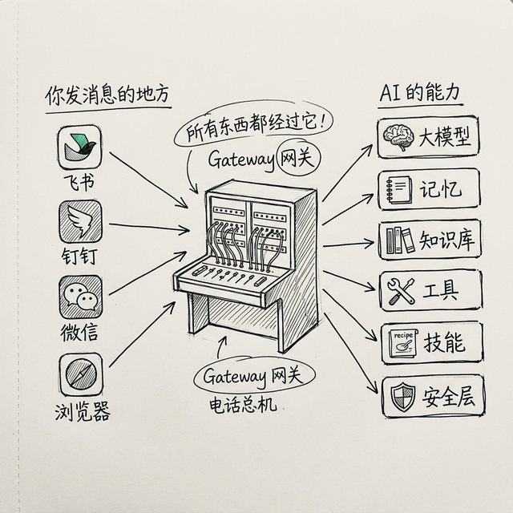
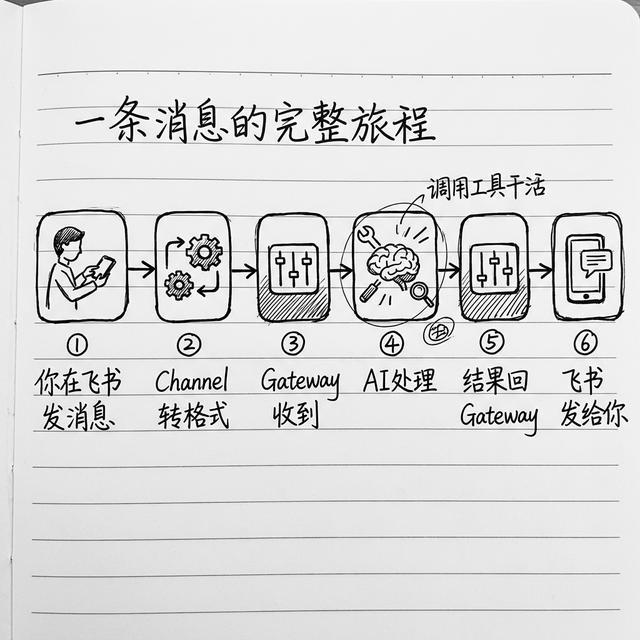

# OpenClaw 的架构：为什么说它像一个"电话总机"

很多朋友一听到"架构"两个字就头大，觉得肯定很深奥，我肯定看不懂。其实真不用怕，OpenClaw 的架构非常简单，我给你用"电话总机"打个比方，一分钟你就能懂。

> 💡 **我又不是开发者，为什么要懂架构？** 其实懂一点架构对你用它很有帮助。举个例子：以后你的 AI 要是没反应了，你知道消息是先经过"网关"再到 AI 的，你就知道要先查网关是不是连着、再查 AI 是不是正常——而不是一脸懵。懂架构不是为了显摆，是为了**出了问题你知道从哪里下手查**。而且下面说的真的不难，一分钟就能懂。

## 一句话就能看懂架构

其实一句话就能说清楚整个流程：

```
你发消息 → 飞书/微信/钉钉 → [Gateway 网关] → 分给 AI 处理 → 结果发回给你
```

这里面的 **Gateway（网关）就是那个电话总机**：

- 每个聊天渠道就像是不同的电话线
- 总机接到你的电话，转给对应的人（AI）接
- AI 说完了，总机再把话转给你

就这么简单，真的没有那么复杂。

## 四个核心部件，每个都是干什么的



OpenClaw 主要就是四个核心部件，我一个个给你说，每个都用大白话：

### 第一个：Gateway（网关）= 总机接线员

这是整个系统的心脏，所有事情都要经过它：

- 管所有连接：不管你从哪个渠道发消息，都先到这里
- 管会话：哪个会话是谁的，现在状态是什么
- 管配置：你的模型啊技能啊这些配置都存在这里
- 管定时任务：到点了它就自动叫醒 AI 干活
- 管路由：消息来了，它知道应该分给哪个 AI 处理

它自己不思考，思考是 AI 的事情，它就是帮你转接——就这么简单。

> 💡 **为什么不能直接连，弄个"中间人"干嘛？** 如果没有网关，每个聊天软件都得自己去找 AI、自己管会话、自己管配置，会乱套。有了网关，所有东西都经过它统一调度，不会乱。这就像公司前台接电话一样——虽然每个员工都有自己的分机，但外面打进来的电话还是得经过前台转接，这样才不会乱。

### 第二个：Channels（渠道适配器）= 电话线

你用飞书聊天，就得有个飞书的适配器；你用钉钉，就得有个钉钉的适配器——它就是电话线。

它做的事情也很简单：

- 你从飞书发消息给它，它转换成 OpenClaw 能懂的格式，交给网关
- OpenClaw 说完了，它把回答转换成飞书能懂的格式，发还给你

好处就是：**你可以同时接好几个聊天软件，体验完全一样**。你今天用飞书，明天换钉钉，OpenClaw 对你的记忆性格都不变，拿起来就能用。

> 💡 **消息是怎么"实时"传到 OpenClaw 的？** 你可能会好奇，你在飞书发了一条消息，OpenClaw 怎么立刻就收到了？其实有两种方式：一种叫"长连接"——OpenClaw 主动和飞书服务器保持一条永不断开的电话线，有新消息就立刻传过来；另一种叫 Webhook，是飞书主动把消息推给你。后面配置飞书的时候，我们用的就是**长连接方式**，好处是不需要你有公网 IP，在家里自己电脑上就能用。

### 第三个：Hooks（钩子）= 叫醒铃

> 💡 **为什么叫"钩子"？** 你可以想象成门口挂的那种钩子——当有东西经过的时候，钩子就会"钩住"它，触发一个动作。在编程里，Hook 就是"当某件事发生的时候，自动做另一件事"。

Hooks 就是一些"机关"——系统发生某个事情的时候，自动触发一段代码跑一下。

比如：

- 系统刚启动 → 触发"启动"钩子，你可以让它自动给你发个消息说我准备好了
- 开了一个新会话 → 触发"新会话"钩子
- 调用工具出错了 → 触发"错误"钩子，自动把错误记到日志里，方便你后来查

好处就是：**你不用改 OpenClaw 核心代码，就能加新功能**，像搭积木一样，想加就加，很方便。

### 第四个：CronJob（定时任务）= 闹钟

普通的 AI 助手都是"被动"的——你不叫它，它不干活。

CronJob 就是闹钟，能让 OpenClaw 主动干活：

- 你设置"每天早上七点"，它到点就自动醒过来，给你发晨间简报
- 你设置"每个星期一早上"，它就每个星期一自动帮你汇总上周进度
- 你设置"每个月一号"，它就自动帮你整理下载文件夹

就像你床头放个闹钟，到点它自己响，不用你每天叫它。这样一来，OpenClaw 真的就像你的一个小助理，到点自己干活。

> 💡 **定时是怎么设置的？** CronJob 用一种叫 **cron 表达式**的格式来表示时间，看起来像是一串数字，比如 `0 7 * * *` 就表示"每天早上 7 点"。顺序是：分钟、小时、日、月、周几。后面具体配置场景的时候会再给你举例，你现在就先知道有这么个东西就行。

## 走一遍完整流程，你一下子就懂了



我带你走一遍完整流程，你马上就明白各个部件怎么配合了：

1. 你在飞书发了一句"帮我整理一下今天邮件" → 飞书 Channel 收到
2. Channel 把消息转成标准格式 → 发给 Gateway 总机
3. Gateway 收到，找到对应的 AI 会话 → 把消息交给 AI
4. AI 看懂你的需求 → 先调用搜索工具找最新邮件规则 → 再调用邮件工具读取邮件 → 分类总结 → 得到结果
5. AI 把结果给回 Gateway → Gateway 给回飞书 Channel
6. 飞书 Channel 把结果发给你 → 你看到总结

就是这么简单，一趟流程走下来，事情就做完了。各个部件各干各的，一点不乱。

## 这么设计好处是什么？

这样分开设计，好处太大了：

- **好扩展**：你想要加个新聊天软件？加个 Channel 就行，别的不用改
- **好维护**：每个人干一块，改这块不影响那块
- **好用**：你想加个新的自动化，加个 Hook 就行，不用动核心

这就是好设计，看起来简单，但是好用。

## 进阶：多个 AI 可以同时跑

前面讲的是一个 AI 助手的架构。其实 OpenClaw 还支持**同时运行多个 AI 助手**，每个助手有自己独立的记忆、技能和性格——就像你办公室里不止一个助理，有的负责调研，有的负责写作，有的负责行政。

> 💡 这个功能叫"Multi-Agent"（多智能体），听起来很高级，但原理很简单：就是 Gateway 这个总机可以同时管多个 AI 的会话，每个 AI 各干各的，互不干扰。我们在后面的进阶玩法章节会详细讲怎么玩。

你先知道有这个功能就行，等你用熟了基础功能再来探索它。

## 小结

我再帮你顺一遍：

- OpenClaw 架构就像一个电话总机，四个部件分工明确
- **Gateway** = 总机接线员，管转接调度
- **Channels** = 电话线，各个聊天渠道接入
- **Hooks** = 叫醒铃，事情发生了自动触发
- **CronJob** = 闹钟，定时自动叫醒 AI 干活
- 分工清楚，好扩展好维护

是不是很简单？这下你懂了吧。下一章我们说 OpenClaw 最棒的一个设计——分层记忆，为什么它越用越懂你。

---
