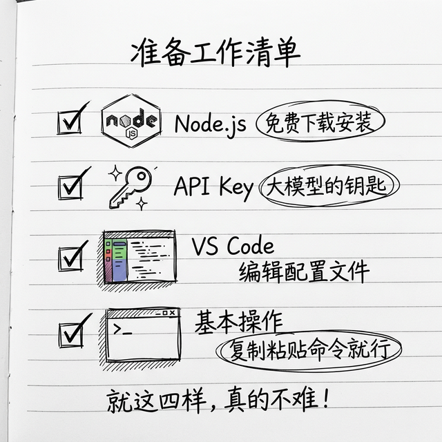

# 准备工作：你开始之前需要准备这些东西

好了，朋友，前面我们把原理都说清楚了，接下来就要动手安装 OpenClaw 了。在开始之前，我们看看你需要准备哪些东西——别怕，东西真的不多，也不难。



## 第一，你需要 Node.js 22 以上版本

OpenClaw 是用 TypeScript 写的，运行需要 Node.js 环境，所以你得先装一个 Node.js，版本要 22 或者更高。

> 💡 **TypeScript 是什么？** 它是一种编程语言，你不需要了解它，这里提到只是为了告诉你为什么要装 Node.js——因为 OpenClaw 是用这个语言写的，Node.js 就是跑它的运行环境。

> 💡 **Node.js 是什么？** 你可以把它理解为一个"运行环境"——就像你要看 PDF 文件需要装 PDF 阅读器一样，要运行 OpenClaw 就需要装 Node.js。你不需要理解它的原理，装上就行。

### 怎么看你有没有安装，版本对不对？

很简单，你打开**终端**，输入下面这行命令，回车。

> 💡 **终端是什么？** 终端就是一个让你用"打字"的方式和电脑沟通的工具。你平时用电脑都是点图标、点按钮，那叫"图形界面"。终端不一样，你得打字输入命令，电脑读懂了就执行。

**怎么打开终端？照着做：**

| 系统 | 怎么打开 |
|------|---------|
| **macOS** | 按 `Command + 空格` 打开搜索 → 输入"Terminal"→ 回车打开。图标是一个黑色小方块 |
| **Windows** | 按 `Win + R` → 输入 `powershell` → 回车打开。或者在开始菜单搜索"PowerShell" |

> ⚠️ **Windows 用户请注意**：本书的命令都在 **PowerShell** 里运行，不要用老旧的"命令提示符（cmd）"。PowerShell 是 Windows 10 以上自带的，功能更强。
>
> ⚠️ **终端不是黑客工具！** 很多朋友看到终端那个黑乎乎的界面就紧张，觉得一不小心会把电脑搞坏。放心，终端就是和电脑的另一种沟通方式，你在里面敲的每一条命令，和你点图标操作是一样的效果。你跟着本书的命令走，完全不用担心。

```bash
node --version
```

如果输出像是 `v22.0.0` 这样，版本号大于等于 22，那就没问题，可以用。

如果提示你 `command not found`，那就是没安装，或者安装了没放到 PATH 里，需要重新装一下。

> 💡 **PATH 是什么？** 当你在终端输入一个命令（比如 `node`），电脑需要知道这个程序到底在哪个文件夹里。PATH 就是一个"地址清单"，电脑会按这个清单一个个去找。如果 Node.js 装了但路径没加到 PATH 里，电脑就找不到它，就会说 `command not found`。一般正常安装的话 PATH 会自动设好，不用你管。

### 怎么安装 Node.js 呢？

#### macOS 用户——照着做：

1. 打开浏览器，访问 https://nodejs.org/
2. 点击下载 **LTS 版本**（LTS 是"长期支持版"，稳定可靠，选这个就对了）
3. 双击下载的 `.pkg` 文件
4. 跟着提示一步步点"继续"→"同意"→"安装"
5. 输入你的电脑密码（正常的，不是黑客行为）
6. 安装完成后，**关掉终端重新打开**
7. 输入 `node --version`，能看到版本号就成功了

> 💡 已经用过 Homebrew 的朋友？直接 `brew install node` 也行，效果一样。

#### Windows 用户——照着做：

1. 打开浏览器，访问 https://nodejs.org/
2. 点击下载 **LTS 版本**（会自动给你 Windows 的 `.msi` 安装包）
3. 双击下载的 `.msi` 文件
4. 一路点"Next"→ 勾选"I accept..."→ 继续点"Next"→"Install"
5. 可能会弹出"是否允许此应用对你的设备进行更改"，点"是"
6. 安装完成后，**关掉 PowerShell 重新打开**
7. 输入 `node --version`，能看到版本号就成功了

> 💡 小提示：安装完 Node.js，npm 也一起给你装好了，不用单独装。

## 第二，你需要一个大模型的 API Key

OpenClaw 它就是一个平台，对不对？它自己不会"思考"，思考需要大模型，所以你得有一个大模型的 API Key 才能用。

> 💡 **API Key 是什么？** 你可以把它理解为一把"数字门禁卡"。大模型服务商（比如 OpenAI、DeepSeek）把 AI 能力放在了云端服务器上，你要用这个能力，就需要一把"钥匙"——这就是 API Key。你注册账号之后，服务商会给你一串长长的字母和数字组成的密钥，OpenClaw 拿着这个密钥就能调用大模型帮你干活了。每次调用都会扣一点点费用，和手机话费类似。

### 我该选哪个大模型呢？

我给你整理一个表格，你自己对着选：

| 厂商 | 优点 | 适合谁 | 注册地址 |
|------|------|--------|----------|
| OpenAI GPT-4o | 综合能力最强 | 不在乎钱，想要最好效果 | platform.openai.com |
| Anthropic Claude 3.5 | 长文本处理好，安全性高 | 处理长文档、注重安全 | console.anthropic.com |
| DeepSeek | 性价比极高，中文能力好 | 想省钱又要好效果 | platform.deepseek.com |
| 阿里通义千问 | 国内直接用，不用科学上网 | 国内朋友 | dashscope.console.aliyun.com |
| 百度文心一言 | 国内直接用 | 国内朋友 | cloud.baidu.com |

> 💡 **我的建议**：如果你在国内、预算有限，首推 **DeepSeek**——价格便宜，中文能力也很好；如果你能科学上网、追求最好效果，选 **Claude 3.5** 或 **GPT-4o**。不管选哪个，OpenClaw 都支持，而且**以后想换随时能换**，改一下配置就好了，不用重新安装。
>
> 💡 **要花多少钱？** 真不用多。大模型是按使用量收费的（你用多少算多少），普通个人用户每个月花费大概十几块到几十块钱，不会很贵。你先充个几十块钱完全够你玩很久了。
>
> 💡 **"按使用量"是怎么算的？** 大模型计费用的单位叫 **token**。一个 token 大概是一个汉字或者半个英文单词。你发给 AI 的话算"输入 token"，AI 回你的话算"输出 token"，加起来就是你这次用了多少。举个例子：你问了一句 50 字的问题，AI 回了 200 字，加起来大概 250 个 token——这点用量收费可能不到一分钱。所以真的很便宜，不用担心。

### 怎么拿到 API Key 呢？

其实不管哪个厂商，流程都差不多：

1. 去厂商的官方网站注册账号
2. 充值一点钱——真不用多，几块钱几十块钱够你玩很久了
3. 进到 API 管理页面，创建一个新的 API Key
4. 复制出来找个地方存好，后面配置 OpenClaw 要用

> ⚠️ 重要提醒：你的 API Key 一定一定保存好，别告诉别人，也别放到 GitHub 公开仓库里——别人拿到了就能用你的钱消费。

## 第三，你需要一个文本编辑器（推荐 VS Code）

后面我们需要编辑配置文件，你得有一个好用的文本编辑器。**不要用记事本**（Windows 自带的那个），它不支持 JSON 语法高亮，容易出错。

推荐安装 **VS Code**（全名 Visual Studio Code）——免费的，微软出品，全球最流行的代码编辑器。

> 💡 **VS Code 是什么？** 就是一个高级版的"记事本"，专门用来编辑代码和配置文件。它会用不同颜色高亮显示内容，帮你发现拼写错误，非常好用。

### 安装方法：
1. 打开浏览器，访问 https://code.visualstudio.com/
2. 点击大大的 **Download** 按钮（它会自动识别你的系统）
3. 下载完双击安装，一路"下一步"就行
4. 装完后，打开终端输入 `code --version`，有版本号说明装好了

> 💡 **macOS 用户注意：** 如果输入 `code` 提示找不到命令，需要多做一步：
> 打开 VS Code → 按 `Command + Shift + P` → 输入 `shell command` → 点击 **"Shell Command: Install 'code' command in PATH"**。这样以后就能在终端里用 `code` 命令打开文件了。

> 💡 **不想装 VS Code？** 用 Cursor（https://cursor.sh）也行，功能类似。或者你有其他习惯的编辑器也可以，只要能编辑 `.json` 和 `.md` 文件就行。

## 第四，你需要会一点基础的电脑操作

你不需要会写代码，真的，但是你需要会下面这几件事。**不会也没关系，我现在就教你：**

### 🖥️ 怎么打开终端？

上面教过了，再说一遍：

| 系统 | 怎么打开 |
|------|---------|
| **macOS** | 按 `Command + 空格` → 输入 `Terminal` → 回车 |
| **Windows** | 在开始菜单搜索 `PowerShell` → 点击打开 |

### 📋 怎么在终端里复制粘贴命令？

**这是最重要的技能**——本书 90% 的操作就是复制命令、粘贴到终端、按回车。

| 操作 | macOS 终端 | Windows PowerShell |
|------|-----------|-------------------|
| **复制** | `Command + C` | `Ctrl + C` |
| **粘贴** | `Command + V` | 直接**右键**就是粘贴（或 `Ctrl + V`） |

具体步骤：
1. 用鼠标**选中**本书中的命令文字（那些灰色背景的代码）
2. 按上面的快捷键**复制**
3. 点击终端窗口，**粘贴**
4. 按 **回车** 执行

> ⚠️ **不要手打命令！** 复制粘贴比手打准确得多。手动输入很容易打错一个字母，导致命令执行失败。养成复制粘贴的习惯。

### 📂 `cd` 命令——"去到某个文件夹"

后面的章节里你会偶尔看到 `cd` 这个命令，它的意思就是 **"切换到某个文件夹"**（Change Directory）。

```bash
cd ~/Documents
```

这就相当于你在文件管理器里双击打开了 `Documents` 文件夹。终端里你"在哪个文件夹"很重要，因为很多命令要在正确的位置才能执行。

### ❌ 出错了怎么办？

终端会用英文告诉你哪里出了问题。你不用读懂，**只需要做一件事：把错误信息复制下来，发给 AI（比如 ChatGPT 或者 DeepSeek），问它怎么解决。**

常见的错误信息翻译：

| 英文错误 | 中文意思 | 怎么办 |
|---------|---------|--------|
| `command not found` | 这个命令找不到 | 可能没安装，或者要重启终端 |
| `permission denied` | 没有权限 | 在命令前加 `sudo`（macOS）或以管理员身份运行 PowerShell（Windows） |
| `No such file or directory` | 文件或文件夹不存在 | 检查路径有没有打错 |
| `EACCES` | 权限不够 | 同"permission denied" |

> 💡 **记住：出错是正常的，不是你笨。** 就算是专业程序员，也天天在终端里碰到报错。关键是不要慌，把错误信息复制出来搜一下或者问 AI，99% 的问题都能解决。

> 💡 **macOS 和 Windows 的命令有区别吗？** 本书用到的绝大多数命令（`npm`、`node`、`openclaw`、`clawhub`、`code`、`docker`）在两个系统里**完全一样**，你直接复制粘贴就能跑。只有很少几个基础命令有差异：
>
> | macOS | Windows PowerShell | 用途 |
> |-------|-------------------|------|
> | `mkdir -p xxx` | `mkdir xxx -Force` | 创建文件夹 |
> | `ls -la` | `dir -Force` | 显示所有文件 |
> | `cat 文件名` | `Get-Content 文件名` | 查看文件内容 |
> | `open .` | `explorer .` | 打开当前文件夹 |
> | `~/xxx` | `$HOME\xxx` | 用户目录下的路径 |
>
> 后面章节如果遇到这些命令，我会标注清楚。全书附录也有一份完整的命令速查表。

## 还要准备什么别的吗？

真的不用了，**就这四样东西**：

1. Node.js 22 以上
2. 一个大模型的 API Key
3. VS Code 编辑器
4. 会一点基础操作（不会也没关系，上面都教了）

你看，是不是很简单？

## 我都准备好了，下一步做什么？

准备好了，我们下一章开始安装，一步一步跟着走，保证你能装上。

---
