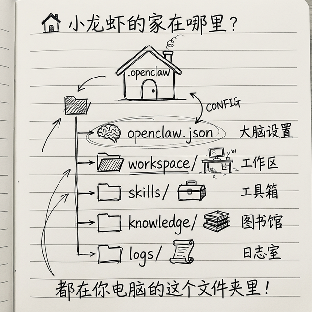

# 第一步：安装 OpenClaw - 跟着官方走准没错

好了，准备工作我们做好了，现在开始安装 OpenClaw。

我先和你说好：OpenClaw 这个项目更新真的很快，可能我这本书印出来的时候，具体命令已经变了。所以我不会死给你贴命令，我告诉你**方法**——方法对了，命令怎么变你都能装上。

记住一句话：**永远跟着官方走，出了问题看官方最新文档，准没错。**

## 安装其实就是一行命令，真的很简单


OpenClaw 官方推荐用 npm 全局安装，你打开终端，输入这一行命令回车就行了：

> 💡 **npm 是什么？** npm 是 Node.js 自带的"软件安装工具"，你装好 Node.js 它就自动有了。你可以把它理解为 macOS 上的 App Store——只不过它是在终端里用命令安装软件，而不是点图标。`npm install -g` 就是说"请帮我全局安装这个软件"。

> 💡 **放心，下面的命令不会弄坏你的电脑。** 安装 OpenClaw 就像安装一个普通 APP，它不会修改你的系统设置，不会删除你的文件。万一安装失败了，卸载也很简单（后面会说）。

```bash
npm install -g openclaw@latest
```

输完了你就歇会儿，等它装，几分钟就好了。中间会出来一堆 warning（警告），你不用管，那些不影响用，只要最后没说"error"（错误）就是没问题。

> ⚠️ **npm WARN 不等于出错！** 安装过程中你会看到很多黄色的 `WARN` 信息，比如 `npm WARN deprecated` 或者 `npm WARN optional`。**这些全是正常的**，不用理会。它只是在告诉你"某些包有了更新版本"或者"某些可选依赖没装上"，完全不影响使用。只要没有红色的 `ERR!` 或者 `error`，就没问题。
>
> 💡 **如果你用 sudo 安装**（命令前加了 `sudo`），终端会要你输入电脑密码。注意：**你输入密码的时候屏幕上什么都不会显示**——不是卡住了，也不是键盘坏了，是终端故意不显示密码，防止别人偷看。你照常打完密码按回车就行。

## 装完了，怎么验证装上了？

很简单，输入这个命令：

```bash
openclaw --version
```

如果它给你输出版本号，像是这样：

```
openclaw 1.0.0
```

那就是装上了，恭喜你！

如果它说 `openclaw: command not found`，那就是没装上，一般是这两个问题：

1. 你安装完没重启终端，关掉终端重新打开就好了
2. 你的 npm 全局安装目录没加到 PATH 环境变量里，你搜一下"npm global bin path"，按照教程加一下就好了

## 接下来初始化配置，跟着向导走就行

装好了，我们运行初始化向导，它一步步带你配置，很省心：

```bash
openclaw onboard --install-daemon
```

> 💡 **daemon 是什么？** daemon（守护进程）就是一个在后台默默运行的程序，不会弹出窗口，你也不用管它。加上 `--install-daemon` 就是让 OpenClaw 在后台自动运行，你不用每次都手动启动它。

这个向导会一步步问你，我给你提前说一下每个步骤怎么选，你心里有数：

### 第一步：安全提示

它上来会问你："你认为当前环境安全吗"，如果你是在你自己个人电脑上用，选 `Yes` 就行了。

### 第二步：选配置模式

它问你配置模式，新手朋友我推荐你选 **QuickStart**，先快速跑起来，所有配置你后面都能改，不急。

### 第三步：选你的模型厂商

接下来选模型厂商，如果你不差钱想要最好效果，直接选 OpenAI 或者 Anthropic 就行。如果你在国内不想折腾，选百度或者阿里的模型就行。

如果它列表里没你想要的厂商，没关系，选 `Skip for now` 就行了，后面我教你自己改配置文件，很简单。

### 第四步：输入 API Key

选好厂商，它让你输 API Key，你把你之前准备好的 API Key 粘进去就行。

### 第五步：选具体模型

厂商选好了，接下来选具体哪个模型，比如你选了 OpenAI，它让你选 `gpt-4o` 还是 `gpt-3.5-turbo`，你选你想用的就行。

如果你想自己输模型 ID，选 `Enter model manually` 自己输。

### 第六步：配置消息渠道

就是问你要不要现在配置聊天渠道（比如飞书），我推荐你**先 Skip**，我们后面专门有一章讲怎么配置飞书，现在先把基础跑起来，不着急。

### 第七步：安装技能

问你要不要现在装技能，同样推荐你**先 Skip**，跑起来基础功能再说，后面装技能很简单，我们专门讲。

### 第八步：配置 Hooks

最后一步，它让你选 Hooks，我推荐你把这两个勾上：

- `command-logger`——所有命令都记日志，出了错方便查，特别有用
- `session-memory`——你用 `/new` 开新会话不会丢状态，好用

勾好了回车，它就帮你配置完了。

### 最后给你 WebUI 地址

配置完了，它最后会给你一个地址，像是这样：

```
WebUI: http://127.0.0.1:18789/token/xxxxxxxxxx
```

> 💡 **WebUI 是什么？** WebUI 就是"网页版操作界面"。你用浏览器打开这个地址，就能看到一个类似聊天窗口的页面，你可以直接在里面和 AI 对话。`127.0.0.1` 这个地址表示"你自己的电脑"，所以它不会被外人访问到，很安全。

## 验证一下，能不能用

你把那个 WebUI 地址复制，打开浏览器，要是能看到 OpenClaw 的控制界面，你能发消息，它能回你，**就是安装成功了！**

要是你已经配置了 API Key，现在就能直接在 WebUI 里聊天了，试试问它一个问题，看它回不回。

## 🏠 小龙虾的"家"在哪里？



安装完了你可能会好奇：OpenClaw 的配置、技能、记忆这些东西，到底存在我电脑的哪里？

**答案：全部存在一个叫 `.openclaw` 的文件夹里。**

| 系统 | 完整路径 | 怎么打开它 |
|------|---------|-----------|
| **macOS** | `/Users/你的用户名/.openclaw/` | 打开 Finder → 按 `Command + Shift + G` → 输入 `~/.openclaw` → 回车 |
| **Windows** | `C:\Users\你的用户名\.openclaw\` | 打开文件资源管理器 → 地址栏输入 `%USERPROFILE%\.openclaw` → 回车 |

打开后你会看到这些文件和文件夹：

```
.openclaw/
├── openclaw.json    ← 核心配置文件（相当于"大脑设置"）
├── workspace/       ← SOUL.md、USER.md 等人设文件在这里
├── skills/          ← 你装的技能在这里
├── knowledge/       ← 你的知识库在这里
└── logs/            ← 运行日志在这里
```

> 💡 **建议你把这个文件夹"收藏"起来。** macOS 用户可以把 `.openclaw` 文件夹拖到 Finder 侧边栏的"个人收藏"里；Windows 用户可以右键 → "固定到快速访问"。这样以后你随时能找到它，不用每次都手动输路径。
>
> ⚠️ **`.openclaw` 是一个隐藏文件夹**（文件名以 `.` 开头），默认不显示。显示方法：macOS 按 `Command + Shift + .`，Windows 在"查看"菜单勾选"显示隐藏的项目"。

## 🎉 装好了！接下来做什么？

很多人装完之后会有一瞬间的迷茫："然后呢？"——别慌，跟着下面三步走，30 分钟内你就能体验到 AI 助理的威力：

### 第一步：先聊个天试试（1 分钟）

打开刚才的 WebUI 地址（`http://127.0.0.1:18789/token/xxx`），随便问 AI 一个问题：

> "帮我写一封请假邮件，理由是家里有事，语气要诚恳"

如果它回复了，说明你的大模型配置没问题，基础功能已经可以用了。

### 第二步：装第一个技能，让 AI 能上网（5 分钟）

现在的 AI 只能回答问题，还不能上网搜东西。装一个搜索技能让它变强：

```bash
clawhub install tavily-search
```

> 💻 **Windows 用户：** 打开 PowerShell，同样输入上面这行命令，效果完全一样。

装好后试试：

> "帮我搜一下今天的科技新闻，总结成 3 条"

**第 13 章**会教你怎么找到更多好用的技能。

### 第三步：接上手机，随时随地用（20 分钟）

目前你只能在电脑浏览器里跟 AI 聊天。想在手机上也能用，需要把它接到飞书：

> 详细步骤看 **第 10 章「接入飞书」**，跟着一步步做就行。

配好之后，你在手机飞书里给 AI 发消息，它就能帮你干活了——开会的时候偷偷让它帮你整理会议纪要，通勤的时候让它帮你总结新闻，睡前让它帮你规划明天的日程……

> 💡 **完成以上三步，你已经超过 90% 的人了。** 接下来你可以翻到**第 19 章**看看"八大实用场景"，找到最适合你的用法，慢慢探索。

## 装错了，出问题了怎么办？

很简单：

1. 先看错误提示说什么，把关键错误复制下来
2. 去 GitHub 搜一搜，基本上常见错误都有人碰到过，也有解决方法
3. 搜不到，你就去 OpenClaw GitHub 开个 Issue，社区有人帮你

### 常见安装问题：

| 问题 | 原因 | 解决办法 |
|------|------|----------|
| `command not found`（macOS）或 `不是可识别的命令`（Windows） | npm 全局目录没在 PATH 里 | 关掉终端重开；或搜"npm global bin PATH" |
| 安装过程报红色 `error` | 可能是网络问题或权限问题 | 检查网络；macOS 试试 `sudo npm install -g openclaw@latest`；Windows 以管理员身份运行 PowerShell |
| Node.js 版本太低 | 需要 22 以上版本 | 去 nodejs.org 下载最新 LTS 版本 |

> 💡 **Windows 用管理员身份运行 PowerShell 的方法**：在开始菜单搜索"PowerShell"→ 右键 →"以管理员身份运行"→ 点"是"。

## 不想折腾命令行？还有其他安装方式

### 方式二：Docker 一键部署（推荐怕折腾的朋友）

> 💡 **Docker 是什么？** 你可以理解为一个"打包好的虚拟环境"——OpenClaw 和它需要的所有东西都打包在一个盒子里了，你只要装好 Docker，一条命令就能把整个环境跑起来，不用担心版本冲突的问题。

如果你装了 Docker，一行命令就搞定：

```bash
docker run -d --name openclaw -p 18789:18789 openclaw/openclaw:latest
```

Docker 的好处是——隔离干净、不影响你电脑的其他东西、出问题了删掉重来很容易。

### 方式三：云服务一键部署

如果你不想在自己电脑上折腾，腾讯云、阿里云这些大厂现在都有 OpenClaw 的一键部署方案，几分钟就能搞定。搜一下"腾讯云 OpenClaw 部署"或者"阿里云 OpenClaw"就能找到教程。

不过我个人还是推荐你先在自己电脑上跑——因为 OpenClaw 最大的优势就是**数据在你自己手上**，放到云上就少了这个优势。

## 小结

其实安装真的很简单：

1. 一行命令安装：`npm install -g openclaw@latest`
2. `openclaw --version` 验证装上了
3. `openclaw onboard --install-daemon` 跟着向导配置
4. 打开 WebUI 能聊天就是成功

很简单对不对？下一步我们说，怎么配置模型，如果你初始化的时候跳过了，或者想加新模型，看我下一章。

---
