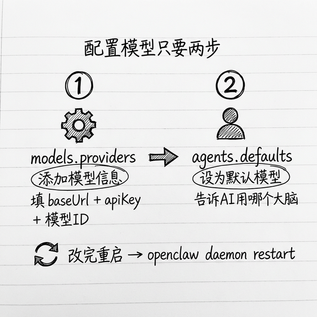
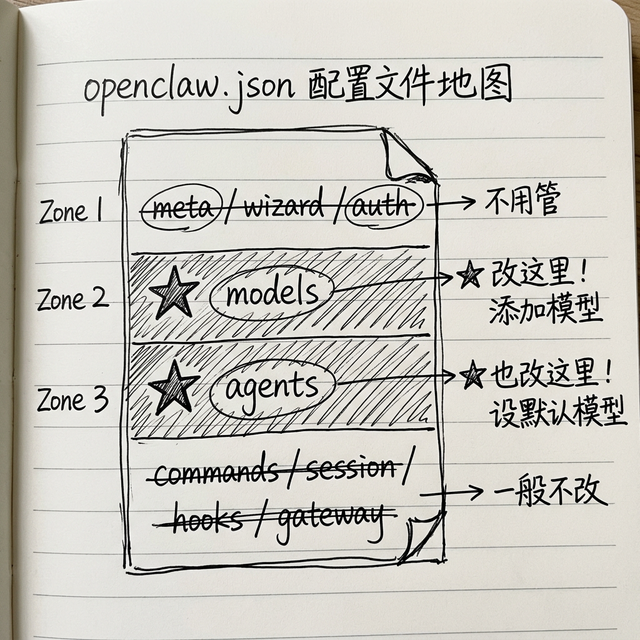

# 配置大模型：把你的 API Key 放对地方

如果你刚才初始化的时候已经配置好模型了，那这一章你可以跳过，直接看下一章就行了。如果你没配置，或者想再加个模型，看完这一章你就会了。

## 配置文件在哪里，你先找到它



OpenClaw 的核心配置文件就在这里：

```
~/.openclaw/openclaw.json
```

`~` 就是你的用户目录：

| 系统 | 配置文件完整路径 |
|------|-----------------|
| **macOS** | `/Users/你的用户名/.openclaw/openclaw.json` |
| **Windows** | `C:\Users\你的用户名\.openclaw\openclaw.json` |

这个文件就是一个普通的 JSON 文件，你用 VS Code 或者 Cursor 打开编辑就行。

> ⚠️ **找不到 .openclaw 文件夹？** 它是一个"隐藏文件夹"——文件名以点（`.`）开头的文件夹默认不显示。查看方法：
> - **macOS Finder**：按 `Command + Shift + .`（三个键同时按），隐藏文件就显示出来了，再按一次隐藏回去
> - **Windows 文件资源管理器**：点击"查看"菜单 → 勾选"显示隐藏的项目"
> - **终端**：输入 `ls -la ~/`（macOS）或 `dir -Force ~\`（Windows PowerShell）

> 💡 **JSON 是什么？** JSON 是一种用来存储配置信息的格式，就像一份结构化的购物清单。它用大括号 `{}` 表示一组相关的信息，用方括号 `[]` 表示一个列表，用冒号 `:` 表示"名字和对应的值"。比如 `"name": "小管家"` 就是说"名字是小管家"。它对格式要求比较严格——少一个逗号、多一个括号都会报错。不过不用担心，后面我会教你怎么检查。

## 这个配置文件里到底有什么



你打开一看，里面一级菜单就这几个，我给你说哪个我们需要改：

```
meta     → 元数据，不用管它
wizard   → 向导运行记录，不用管它
auth     → 认证配置，不用改
models   → 模型配置，**我们就要改这里**
agents   → AI 行为配置，**我们也要改这里**
commands → 命令权限控制，一般不用改
session  → 会话配置，不用管
hooks    → 钩子，你初始化的时候选好了
gateway  → 网关网络配置，一般不用改
```

所以我们改就是改两个地方：`models` 和 `agents`，就这么简单。

## 添加一个新模型，我一步步带你做

我给你举个实际例子，比如我们添加阿里云百炼的通义千问，你照着做就行：

### 第零步：用 VS Code 打开配置文件

**macOS** —— 在终端输入：

```bash
code ~/.openclaw/openclaw.json
```

**Windows** —— 在 PowerShell 输入：

```powershell
code $HOME\.openclaw\openclaw.json
```

打开后你会看到一个 JSON 文件，别被吓到——我们只需要改其中两个地方。

### 第一步：在 `models.providers` 添加你的模型信息

找到 `models` → `providers`，在这里加一块就行了，我给你模板：

```json
"models": {
  "mode": "merge",
  "providers": {
    "bailian": {
      "baseUrl": "https://dashscope.aliyun.com/completion",
      "api": "dashscope-messages",
      "apiKey": "sk-xxxxxxxxxxxxxxxxxxxxxxxxxxxx",
      "models": [
        {
          "id": "qwen-plus",
          "name": "通义千问 Plus",
          "reasoning": true,
          "input": ["text"],
          "cost": {
            "input": 0.08,
              "output": 0.2,
              "cacheRead": 0.01,
              "cacheWrite": 0.02
          },
          "contextWindow": 128000,
          "maxTokens": 4096
        }
      ]
    }
  }
}
```

我给你说每个字段是干嘛的，你照着填就行：

| 字段 | 干什么 |
|------|----------|
| `baseUrl` | 厂商给你的 API 地址（就是大模型服务的"入口网址"），去厂商文档找就能找到。注意要完整复制，不要多加或少加 `/` |
| `api` | API 格式，OpenClaw 支持几种常用的，比如 `anthropic-messages` / `openai-chat` / `dashscope-messages` |
| `apiKey` | 你的 API Key 填这里 |
| `models` → `id` | 模型 ID，厂商叫它什么你就填什么 |
| `models` → `name` | 给它起个好记的名字 |
| `models` → `reasoning` | 这个模型支持推理思考吗？支持就填 true |
| `models` → `input` | 支持什么类型的输入，一般就是 `["text"]` |
| `models` → `cost` | 价格，每百万 tokens 多少钱，OpenClaw 用来统计你花了多少钱 |
| `models` → `contextWindow` | 它上下文窗口多大，多少 tokens |
| `models` → `maxTokens`  | 最大输出多少 tokens |

> 💡 **"mode": "merge" 是什么意思？** 这个字段告诉 OpenClaw：你新加的模型配置和已有的配置**合并在一起**，不会覆盖。就是说你加新的不影响旧的，不用担心。你不用改它，保持默认就行。
>
> 💡 **"reasoning" 是什么意思？** 有些新一代大模型支持"推理思考"——就是在回答你的问题之前，先在内部"敢想"一番，把思考过程理清楚了再回答你。这种模型处理复杂问题（比如数学计算、多步骤任务）更准确，但回复会稍微慢一点，token 用量也多一些。如果你的模型支持这个功能，就填 true；不确定的话填 false 就行。
>
> 💡 **token 和 contextWindow 是什么？** 前面准备工作章我们说过，token 就是大模型计费的单位，大概一个汉字算一个 token。`contextWindow` 就是这个模型一次能"记住"多少文字——128000 就是大约能记住 12 万字，已经很多了。`maxTokens` 就是 AI 一次最多能回复你多少字。这些你照着模板填就行，不用纠结。

照着模板填，注意一下**括号逗号别漏了**，JSON 格式错了就加载失败，你填完可以去网上找个"JSON 校验"工具检查一下，没问题再保存。

> 💡 **如果你用 DeepSeek**，配置更简单，把上面的 `baseUrl` 改成 `https://api.deepseek.com`，`api` 改成 `openai-chat`，模型 ID 填 `deepseek-chat` 就行。DeepSeek 性价比很高，中文能力好，推荐国内朋友用。
>
> ⚠️ 各家厂商的 `baseUrl` 地址可能会更新，建议以厂商官方文档为准。如果配置后连接不上，第一步就去官方文档确认一下地址有没有变。

### 第二步：在 `agents.defaults` 配置默认模型

加好模型信息了，你还要告诉 OpenClaw **默认用哪个模型**。找到 `agents` → `defaults` → `model`，改成这样：

```json
"agents": {
  "defaults": {
    "model": {
      "primary": "bailian/qwen-plus",
      "fallbacks": ["anthropic/claude-3-sonnet"]
    },
    "models": {
      "bailian/qwen-plus": {
        "alias": "通义千问"
      }
    }
  }
}
```

`primary` 就是 `你的提供者ID/模型ID`，我们刚才就是 `bailian/qwen-plus`，填上。然后在 `models` 里给它起个别名，以后你用 `/model 通义千问` 就能切换，很方便。

那个 `fallbacks` 是干嘛的？就是**模型回退**——如果主模型调用失败了（比如配额用完了，服务挂了），自动用备用模型，不容易掉链子，你可以加上。

### 第三步：保存，刷新配置

改完保存文件，你需要重启一下 OpenClaw 服务，或者在 WebUI 控制面板点一下"更新配置"，它就会重新加载配置了。

### 第四步：测试一下能不能用

配置加载完了，你打开聊天框输入：

```
/model
```

它就会给你列出所有配置好的模型，能看到你刚加的模型就是成功了。你输入 `/model 你的模型别名` 就能切过去，发个消息试试，能正常回复就是好了。

## 常见问题，你碰到了可以看看

### Q: 我配置完了，模型不能用，怎么回事？

A: 你按这个顺序检查：
1. JSON 格式对不对？是不是漏了逗号括号？你复制到网上JSON校验工具看一下，很容易找到错
2. API Key 对不对？是不是多复制了空格少复制了字母？
3. baseUrl 对不对？是不是写错了？
4. 你重启 OpenClaw 了吗？改完配置一定要重启才会生效

### Q: 我能配置多个模型吗？

A: 当然可以呀！你想配置几个就配置几个，平时用这个，那个便宜用那个，聊天里输入 `/model 模型名` 就能切，特别方便。

### Q: 我用本地模型可以吗？

A: 完全没问题！只要你的本地模型提供了 OpenAI 兼容的 API，你照着上面这个模板配置就行，`baseUrl` 填你本地的地址就好了。

## 小结

其实配置模型真的很简单：

- 核心配置文件就是 `~/.openclaw/openclaw.json`
- 加模型就是改两处：`models.providers` 加信息，`agents.defaults` 设默认
- 保存重启，测试一下就能用了
- 支持配置多个模型，还支持失败自动回退

好了，配置完了，下一章我们说最重要的——国内用户怎么接入飞书，一步步来。

---
