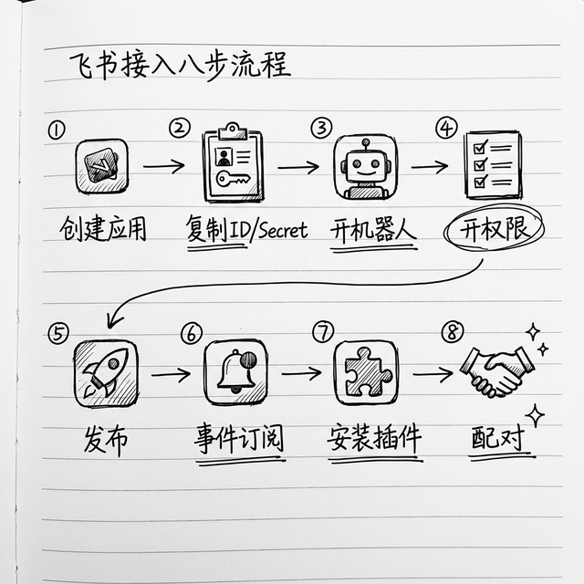

# 接入飞书：国内用户首选，一步步来

OpenClaw 默认支持二十多个聊天渠道（飞书、钉钉、Slack 等等），我推荐国内用户用飞书，原因很简单：

- 飞书国内能直接用，不需要科学上网
- 手机电脑都有客户端，你平时用什么聊天就在哪里用，不用换 APP
- OpenClaw 原生支持，不需要你额外装插件
- **新版本对飞书集成做了优化**，长连接更稳定，用起来更顺
- 配合后面要讲的飞书日历、飞书任务、飞书多维表格这些技能，体验更完整

> 💡 **如果你不用飞书怎么办？** 完全没问题。你可以直接用 OpenClaw 自带的 WebUI（就是浏览器界面），不接聊天软件也能用，只是没有手机端随时随地用那么方便。钉钉等其他渠道也支持，配置方法类似。

这一章我带你一步步来，从创建应用到最后能用，保证你跟着走就能成。



## 第一步：飞书开发者后台创建应用

1. 打开飞书开发者后台：https://open.feishu.cn/app，登录你的账号
2. 点击 **"创建企业自建应用"**

> 💡 **我个人用也要创建"企业自建应用"？** 是的，这个名字听起来像是公司才能用的，其实个人也可以。飞书开发者平台允许任何注册用户创建应用，个人用户自己就是自己的"管理员"，权限自己就能通过，非常方便。你就理解为"创建一个属于你自己的机器人小应用"就行了。

3. 填一下应用名字，比如就叫 `OpenClaw 助手`，传一个你喜欢的头像
4. 点击 **"创建"** 就好了

创建完你就进入开发后台了，接下来我们拿几个关键信息。

## 第二步：复制 App ID 和 App Secret

左边菜单栏点击 **"凭证与基础信息"**，你就能看到：

- App ID
- App Secret

> 💡 **App ID 和 App Secret 分别是什么？** App ID 就是你这个应用的"身份证号"，告诉飞书服务器"我是谁"。App Secret 就是"密码"，证明"这真的是我"。两个配合使用，OpenClaw 才能以你的机器人身份和飞书服务器沟通。**App Secret 千万不能告诉别人**，跟密码一样重要。

把这两个复制出来存好，后面配置 OpenClaw 要用。

## 第三步：开机器人能力

左边菜单栏点击 **"添加应用能力"**，找到 **"机器人"** 卡片，点添加就好了，搞定。

## 第四步：给机器人开权限

机器人要能收发消息，必须开权限。左边点击 **"权限管理"**，把这些权限开了：

> 💡 **为什么要开权限？** 飞书为了安全，默认情况下你创建的机器人什么都做不了——不能读消息、不能发消息、不能看文档。你需要一个个告诉飞书"我允许它做这个"，就像手机 APP 问你"是否允许访问相册"一样。

### 必须开的核心权限：

最简单的方法：在权限管理页面的**搜索框**里搜关键词，逐个勾选：

1. 搜索 **"消息"** → 勾选"获取与发送单聊、群聊消息"相关的所有权限
2. 搜索 **"im:message"** → 确认 `im:message`、`im:message:send_as_bot`、`im:message:readonly` 都勾上了
3. 搜索 **"receive"** → 确认 `im.message.receive_v1` 勾上了

> 💡 **找不到在哪搜？** 飞书权限管理页面通常是一个长列表，上面有一个搜索/筛选框。如果实在找不到，你也可以用**批量导入**的方式——点击"批量开通"按钮（如果有的话），把下面这段 JSON 复制粘贴进去：

### 如果你以后要读写飞书文档/表格，顺便开了这些：

- 读文档 ⇒ `drive:file:read`
- 写文档 ⇒ `drive:file:write`
- 读表格 ⇒ `sheets:spreadsheet`

### 一键导入所有权限（进阶方法）

如果飞书后台支持"导入权限 JSON"，你可以把下面这段**完整复制粘贴**进去，一次性开好所有权限（你不需要理解里面每一行是什么意思）：

```json
{
  "scopes": {
    "tenant": [
      "aily:file:read",
      "aily:file:write",
      "application:application.app_message_stats.overview:readonly",
      "application:application:self_manage",
      "bot:menu:write",
      "cardkit:card:write",
      "contact:user.employee_id:readonly",
      "corehr:file:download",
      "docs:document.content:read",
      "event:ip_list",
      "im:chat",
      "im:chat.access_event.bot_p2p_chat:read",
      "im:chat.members:bot_access",
      "im:message",
      "im:message.group_at_msg:readonly",
      "im:message.group_msg",
      "im:message.p2p_msg:readonly",
      "im:message:readonly",
      "im:message:send_as_bot",
      "im:resource",
      "sheets:spreadsheet",
      "wiki:wiki:readonly"
    ],
    "user": [
      "aily:file:read",
      "aily:file:write",
      "im:chat.access_event.bot_p2p_chat:read"
    ]
  }
}
```

弄好了点**申请开通**，个人账号你自己就是管理员，直接通过。

## 第五步：发布应用，这步必须做

配好权限一定要发布，不发布没法配置事件订阅。

1. 点击顶部菜单栏 **"版本管理与发布"** → "创建版本"
2. 填个版本号，比如 `1.0.0`，说明随便写
3. 点确认发布，等状态变成**已发布**就好了

## 第六步：配置事件订阅，这步很重要

不配置这步，你发消息机器人收不到，一定要做。

1. 左边菜单栏点击 **"事件与回调"**
2. 订阅方式选择 **"使用长连接接收事件"** ✅ 一定要选这个
   - 好处就是**不需要你有公网 IP**，本地电脑就能用，太方便了，推荐所有人用这个
3. 点击"添加事件"，勾选 **接收消息 (im.message.receive_v1)**
4. 机器人回调也选长连接
5. 点保存，然后**重新发布一次**版本，让配置生效

## 第七步：安装飞书插件（新方法，比手动配置简单多了）

OpenClaw 推出了**官方飞书插件**，安装一条命令就搞定，不用手动改 JSON 配置文件了。

在终端里运行：

```bash
npm install -g @openclaw/plugin-feishu
```

> 💻 **Windows 用户：** 打开 PowerShell（建议“以管理员身份运行”），输入同样的命令即可。

安装过程中它会提示你输入 **App ID** 和 **App Secret**——就是你刚才复制的那两个，粘贴进去回车就行。

> 💡 **之前你可能在网上看到过要手动编辑 `openclaw.json` 添加 `channels` 配置的教程**——那是旧版方法，虽然也能用，但官方插件方式更简单，不容易出错。新方法会自动帮你配置好一切。

安装完了，重启 OpenClaw：

```bash
openclaw daemon restart
```

> 💻 **Windows 用户：** 同样在 PowerShell 里输入这行命令。

## 第八步：配对完成就能用了

重启完，你打开飞书找到你的机器人，发一条消息，它会回复你一个配对码，像是这样：

```
请在终端执行这条命令完成配对：
openclaw pairing approve feishu 123456
```

你复制到终端运行一下，就配对完成了。再发消息，机器人就能正常回复你了🎉

> 💡 **为什么要配对，这步不多余吗？** 一点都不多余，这是一个**安全设计**。想想看，如果任何人都可以直接和你的 OpenClaw 对话，那别人就可以用你的 AI、花你的钱、看你的文件了。配对机制保证了**只有你经过授权的用户才能和 AI 对话**，其他人发消息它不理。所以这一步很重要，别跳过。

## 常见问题

### Q: 我发消息机器人没反应，哪里错了？
A: 你对照检查一下：
1. 你发布版本了吗？没发布收不到
2. 你加事件订阅了吗？没加收不到
3. 你安装了飞书插件吗？运行 `npm list -g @openclaw/plugin-feishu` 看看有没有
4. 你重启 OpenClaw 了吗？安装插件后一定要重启
5. 你配对了吗？第一次必须配对

### Q: 需要公网 IP 吗？
A: **不需要**！我们用了长连接，是 OpenClaw 主动连飞书服务器，所以你在家用电脑就能跑，不用公网 IP。

### Q: 群聊能用吗？
A: 当然可以，你把机器人拉进群，说话的时候@它就好了。默认配对模式下，只有配对过的用户才能和它说话，安全。

### Q: 我用的是旧版方法（手动编辑 JSON），要换成新方法吗？
A: 如果旧方法用着没问题，不一定要换。但如果你碰到问题或者要重新配置，建议用新的插件方法，更简单也更稳定。

## 小结

按照这个流程走，现在你已经能在飞书里用 OpenClaw 了。用官方飞书插件接入，比以前手动配置 JSON 简单多了，推荐所有人用这个方式。

下一章：设定 AI 性格，四个文件搞定你的专属人设。

---

