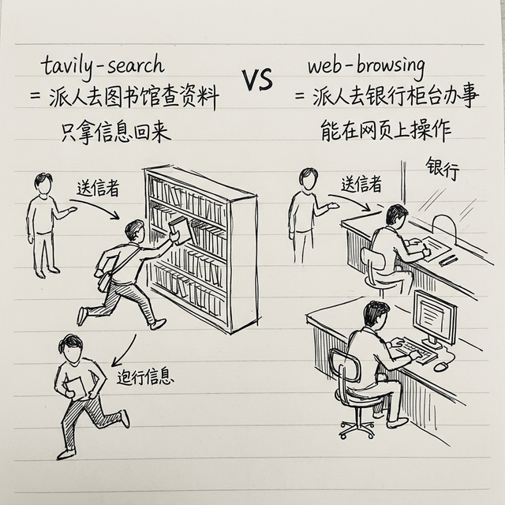

# 核心三件套深度玩法：搜索、总结、浏览器

上一章我教你怎么在 ClawHub 找技能、装技能。这一章我们把**最重要的三个技能**拆开讲透——不只是教你怎么装，我要教你**怎么把它们玩出花来**。

先记住一个概念：**Combo 组合技**——把几个简单技能串在一起，威力远大于单个技能。就像格斗游戏里的连招一样。

> 💻 **Windows 用户注意：** 这一章的 `clawhub install` 命令在 PowerShell 里都能直接用，和 macOS/Linux 完全一样。配置文件路径是 `%USERPROFILE%\.openclaw\openclaw.json`。

---

## 技能一：tavily-search —— 让 AI 能上网搜东西

### 安装

```bash
clawhub install tavily-search
```

### 配置

1. 去 [tavily.com](https://tavily.com) 注册一个免费账号
2. 在后台拿到你的 API Key
3. 打开你的 OpenClaw 配置文件 `~/.openclaw/openclaw.json`（就是之前配置大模型时用的那个文件），在环境变量部分加上：

```json
{
  "TAVILY_API_KEY": "tvly-xxxxxxxxxxxxxxxxx"
}
```

> 💡 **不知道加在配置文件哪里？** 你直接对 AI 说"帮我配置 tavily-search 的 API Key，Key 是 tvly-xxx"，它会帮你自动加到正确的位置。

> 💡 **免费额度够用吗？** 免费版每月 1000 次搜索。你一天搜 30 次也才 900 次，普通用户完全够用。真的不够了再考虑付费（每月 $5），但大多数人用不到。

### 3 个实战案例

**案例 1：每日行业追踪**

> "帮我搜索 AI 领域今天有什么重要新闻和动态，只看靠谱来源，总结成 5 条以内。"

**案例 2：竞品调研**

> "帮我搜一下「瑞幸咖啡」最近一个月有什么大动作？营销、新品、财报相关的都查一下。"

**案例 3：事实核查**

> "网上有人说今年全球 AI 市场规模已经超过 2 万亿美元了，帮我查查这个数字准不准，找到权威来源。"

### 常见坑

- **搜不到中文内容？** tavily-search 默认搜英文比较强。搜中文内容时，建议你在提示里加上"请用中文搜索"或"搜索中文来源"
- **结果不够新？** 加上时间限定："搜索最近 24 小时内的新闻"
- **结果太多太杂？** 加上来源限定："只看 36kr、虎嗅、澎湃这些来源"

---

## 技能二：summarize —— 长内容一键总结

### 安装

```bash
clawhub install summarize
```

> 💡 这个技能是 OpenClaw 内置的，你可能已经有了，不需要额外 API Key。

### 3 个实战案例

**案例 1：几万字的长文 → 3 分钟读完**

> "帮我总结一下这篇文章的核心观点：https://xxx.com/article" 
> 
> "要求：分成「主要观点」「关键数据」「我的行动建议」三个部分"

**案例 2：一小时视频 → 一页纸要点**

> "这个 YouTube 视频讲了什么？帮我提炼 5 个最重要的要点：https://youtube.com/xxx"

**案例 3：对比两篇文章的异同**

> "帮我读这两篇文章，对比一下它们的观点有什么相同和不同的地方"

### 常见坑

- **总结太长了？** 明确告诉它字数："总结成 200 字以内"
- **总结太笼统？** 告诉它你关心什么："我只关心里面关于定价策略的部分"
- **PDF 读不了？** 确保 PDF 是文字版的，不是扫描版。扫描版的 PDF 就是一张图片，AI 需要 OCR 能力才能读（需要多模态模型支持）

---

## 技能三：web-browsing —— 让 AI 操控浏览器

### 安装

```bash
clawhub install web-browsing
```

> 💡 这个技能需要你的电脑上安装了 Chrome 浏览器。如果没有，去 [google.cn/chrome](https://google.cn/chrome) 下载一个。

### 它和 tavily-search 有什么区别？



| | tavily-search | web-browsing |
|---|---|---|
| **能做什么** | 搜索并返回文字结果 | 打开网页、点击、填表、截图 |
| **速度** | 快 | 慢一点（要等网页加载） |
| **适合** | 搜信息 | 需要"操作"网页的场景 |
| **比方** | 像派人去图书馆查资料 | 像派人去银行柜台办事 |

简单说：**搜信息用 tavily，操作网页用 web-browsing**。

### 3 个实战案例

**案例 1：帮你填表**

> "打开 https://xxx.com/form ，帮我把下面这些信息填进去：姓名张三，电话 138xxxx，邮箱 zhangsan@xxx.com"

**案例 2：查价格**

> "帮我打开京东，搜索「MacBook Air M4」，看看现在最低价是多少"

**案例 3：截取网页内容**

> "打开这个网页 https://xxx.com ，截个图给我看看它长什么样"

### 常见坑

- **打不开某些网站？** 有些网站有反爬虫机制，AI 打不开是正常的。换个方法，用 tavily-search 搜内容
- **登录页面怎么办？** web-browsing 可以帮你填用户名密码登录，但**强烈不建议把你的敏感密码交给 AI**。只在你信得过的场景下用
- **操作太慢？** 网页操作本身就比纯文字慢，这是正常的，耐心等一下

---

## 🔥 Combo 组合技：三件套联合出击


单个技能好用，三个串起来更好用。这里教你几个实用的 Combo：

### Combo 1：深度调研（搜索 + 浏览 + 总结）

> "帮我做一份关于「中国新能源汽车市场」的调研报告：
> 1. 先用搜索找 10 篇最近一个月的相关文章
> 2. 打开最重要的 3 篇，完整阅读
> 3. 综合所有信息，写一份 1000 字的调研报告，包含市场规模、主要玩家、发展趋势"

AI 会自动调用三个技能完成这个流程：tavily-search 搜文章 → web-browsing 打开详读 → summarize 总结成报告。

### Combo 2：竞品监控（搜索 + 总结 + 定时任务）

在你的定时任务里加上：

```json
"competitor-watch": {
  "schedule": "0 9 * * 1",
  "prompt": "搜索以下三家竞品公司本周的最新动态：1)瑞幸 2)库迪 3)星巴克中国。每家总结 3 条重要信息，对比分析各家策略有什么变化。"
}
```

每周一早上 9 点自动收到竞品周报。

### Combo 3：内容创作（搜索 + 总结 + 写作）

> "我想写一篇关于「普通人怎么用 AI 提高效率」的小红书笔记：
> 1. 先搜索这个话题最近什么角度比较火
> 2. 参考热门文章的风格和角度
> 3. 帮我写一篇 300 字的笔记，要口语化，带 emoji，有吸引力"

---

## ⚠️ 安全提示：三件套的安全边界

这三个技能很强大，但正因为强大，更要注意安全：

1. **web-browsing 不要操作银行、支付类网站** —— 万一出错，后果严重
2. **搜索结果不一定准确** —— AI 搜到的信息也可能是错的，重要决策前自己核实
3. **不要让 AI 自动操作你不了解的网页** —— 先让它截图给你看，你确认了再让它操作

记住一个原则：**对外操作先看草稿，你确认了再执行。**

---

## 小结

| 技能 | 一句话说明 | 适合场景 |
|------|-----------|---------|
| tavily-search | 让 AI 能搜索互联网 | 查信息、追新闻、做调研 |
| summarize | 长内容一键总结 | 读长文、看视频、过报告 |
| web-browsing | 让 AI 操控浏览器 | 填表、查价、截图 |

**核心三件套是 OpenClaw 80% 使用场景的基础**，先把它们用熟，后面的进阶玩法才玩得起来。

下一章我们看看办公效率类的技能——邮件、日历、文档，帮你把日常工作自动化。

---
