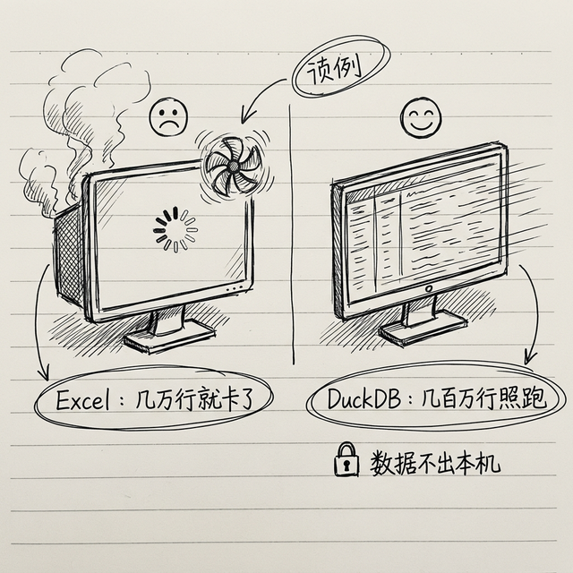

# 内容创作与数据分析技能

这一章我们看两类技能：**帮你写东西**的，和**帮你看数据**的。对于做自媒体、写文章、需要看报表的朋友，这几个技能能让你的效率翻倍。

---

## 内容创作类

### 1. github-cli —— 不只是代码，写书也用得上

GitHub 不光是程序员用的，写文章、写书、管理项目都能用。这个技能让你在聊天里直接操作 GitHub。

#### 安装

```bash
clawhub install github-cli
```

#### 配置

需要 GitHub Personal Access Token：
1. 打开 [github.com/settings/tokens](https://github.com/settings/tokens)
2. 生成一个 Token，权限选 `repo`（仓库读写）
3. 填到配置里：

```json
{
  "GITHUB_TOKEN": "ghp_xxxxxxxxxxxx"
}
```

#### 实战案例

> "帮我把今天的改动提交到 GitHub，备注写'更新第三章内容'"
>
> "看看仓库里有没有人提了 Issue"
> 
> "帮我比较一下这个文件昨天和今天的改动"

---

### 2. spell-check-cn —— 中文拼写和语法检查

写完文章发出去之前，让 AI 帮你检查一遍，避免错别字和语法错误。

#### 安装

```bash
clawhub install spell-check-cn
```

不需要 API Key，装上就能用。

#### 实战案例

> "帮我检查一下这篇文章有没有错别字和语法问题"
> 
> "这段话读起来有点别扭，帮我优化一下表达"

---

## 数据分析类 🆕

### 3. DuckDB —— 本地数据分析神器



DuckDB 是一个轻量级的本地分析数据库。什么意思呢？就是你把 Excel、CSV 文件丢给它，它能直接用 SQL 帮你分析，速度极快，而且**完全在你本地运行，数据不会上传到任何地方**。

> 💡 **为什么推荐 DuckDB 而不是 Excel？** Excel 处理几万行数据就开始卡了。DuckDB 处理几百万行数据都不在话下。而且你不需要学 SQL——你用自然语言告诉 AI 你想查什么，AI 帮你写 SQL，DuckDB 帮你跑。

#### 安装

```bash
clawhub install duckdb
```

#### 配置

不需要额外配置，装上就能用。它会自动识别你给它的文件格式（CSV、Excel、JSON、Parquet 等）。

#### 实战案例

**案例 1：分析销售数据**

> "这是我们上季度的销售数据 sales_q1.csv，帮我分析一下：
> 1. 哪个产品卖得最好？
> 2. 销售额的月度趋势是什么？
> 3. 哪个销售员业绩最好？"

**案例 2：处理大 Excel**

> "这个 Excel 有 50 万行数据，帮我筛选出所有金额大于 1 万元的订单，按日期排序"

**案例 3：多表关联**

> "这两个 CSV 文件，一个是客户信息，一个是订单记录，帮我关联起来，看看哪些客户下单最多"

### 常见坑

- **文件路径要对**：告诉 AI 文件在哪里，用绝对路径最靠谱
- **列名有中文？** 没问题，DuckDB 支持中文列名
- **文件编码问题？** 如果打开乱码，告诉 AI："这个文件是 GBK 编码的"

---

### 4. data-analyst —— 你的 AI 数据分析师

这个技能更强——它不只是查数据，还能帮你**画图表、做分析报告、找规律**。

> 💡 **DuckDB vs data-analyst？** DuckDB 偏"查数据"，data-analyst 偏"做分析"。你可以把 DuckDB 理解为图书管理员（帮你找书），data-analyst 理解为分析师（帮你读书写报告）。两个搭配用，效果更好。

#### 安装

```bash
clawhub install data-analyst
```

#### 实战案例

**案例 1：自动生成数据报告**

> "这是我们今年的用户增长数据，帮我做一份分析报告：
> 1. 画一个月度增长趋势图
> 2. 分析增长最快的月份和可能的原因
> 3. 预测下个季度的增长趋势"

**案例 2：Excel → 可视化图表**

> "这份 Excel 里有各部门的预算和实际支出，帮我做一个对比柱状图"

**案例 3：找异常值**

> "这份数据里有没有什么异常？帮我检查一下金额特别大或特别小的记录"

---

## Combo 组合技：数据分析全流程

### 把 Excel 变成 AI 分析报告

> "帮我做以下事情：
> 1. 打开桌面上的「Q1销售数据.xlsx」
> 2. 用 DuckDB 分析：按产品类别和月份统计销售额
> 3. 用 data-analyst 画一个堆叠柱状图
> 4. 写一份 500 字的分析报告，包含趋势和建议
> 5. 把报告保存为 PDF"

以前这一套流程可能要花你半天时间，现在一句话搞定。

### 定期运营报告

```json
"weekly-report": {
  "schedule": "0 8 * * 1",
  "prompt": "从数据库查询上周的核心运营指标（日活、新增、留存、转化），和上上周对比，生成周报，高亮标注环比变化超过 10% 的指标。"
}
```

---

## ⚠️ 技能断舍离警告


到这里我们已经介绍了不少技能了。你可能有冲动全装上——**别这么干**。

技能装太多有这些问题：

1. **维护成本高**：每个技能都要配置、要更新、要排查问题
2. **安全风险增加**：每多一个技能，就多一个潜在的安全入口
3. **反而更慢**：AI 选择太多反而不如选择少的时候精准

我的建议：**核心三件套 + 你工作最需要的 2-3 个 = 5-6 个就够了**。等你用熟了，再按需加新的。

---

## 小结

| 技能 | 类型 | 一句话 |
|------|------|--------|
| github-cli | 内容创作 | 聊天里操作 GitHub |
| spell-check-cn | 内容创作 | 中文拼写和语法检查 |
| DuckDB | 数据分析 | 本地高速数据查询 |
| data-analyst | 数据分析 | AI 帮你做图表和分析报告 |

下一章我们看看进阶技能——让 AI 自我进化、跨平台自动化，这些是真正玩出花来的工具。

---
