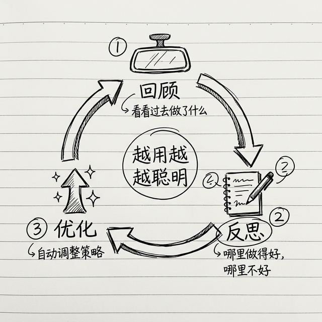

# 进阶技能：自动化与自我进化

前面三章我们从核心三件套到办公效率到数据分析，已经覆盖了日常使用的大部分场景。这一章我们进入"高阶玩法"——让你的 AI 自动进化、连接几百个工具、编排复杂工作流。

> ⚠️ 这些技能功能强大，但上手门槛也稍高一些。建议你**先把前面的基础技能用熟了**，再来玩这些。

---

## 1. capability-evolver —— AI 自我进化



这个技能特别有意思：它能让你的 AI **自动复盘过去的对话**，总结什么做得好、什么做得不好，然后**自动优化自己的工作方式**。

ClawHub 安装量超过 35,000 次，排名第一。

### 安装

```bash
clawhub install capability-evolver
```

### 它怎么做到"进化"的？

简单说就是三步循环：

1. **回顾**：AI 定期回看最近的对话记录
2. **反思**：分析哪些回答你觉得好（你夸了的），哪些你觉得不好（你重新让它改的）
3. **优化**：把这些经验写进自己的"能力手册"，下次遇到类似情况就做得更好

就像一个新员工——刚来的时候什么都不太会，但是每周做一次复盘总结，一个月后就顺手多了。

### 实战案例

> "回顾一下我们最近一周的对话，总结一下哪些地方做得好、哪些地方你可以改进的"
>
> "根据我们之前的互动，你觉得我更喜欢什么样的回复风格？长的还是短的？正式的还是随意的？"

### 常见坑

- **进化需要时间**：至少用一两周，积累了足够多的对话记录，进化效果才明显
- **别期望太高**：它的"进化"是渐进式的微调，不是突然变得超级聪明

---

## 2. self-improving-agent —— 更深度的自我优化

如果说 capability-evolver 是"做复盘笔记"，那 self-improving-agent 就是"重新训练自己"——它会根据你的使用习惯，生成新的 SKILL.md 文件来优化自己的工作流。

### 安装

```bash
clawhub install self-improving-agent
```

### 它和 capability-evolver 有什么区别？

| | capability-evolver | self-improving-agent |
|---|---|---|
| 做什么 | 复盘对话，优化回复风格 | 分析工作流，自动生成新技能 |
| 比方 | 像写工作日记 | 像编写操作手册 |
| 适合 | 所有人 | 已经有固定工作流的用户 |

### 实战案例

> "分析一下我最近做的重复性工作，有没有可以自动化的？帮我生成一个技能来自动化它"

---

## 3. composio —— 860+ 工具集成框架

一个技能连接 860 多个第三方工具：GitHub、Slack、Gmail、Salesforce、Notion、Trello、Airtable……你能想到的工具它基本都有。

### 安装

```bash
clawhub install composio
```

### 什么时候需要它？

当你发现自己需要连接**三个以上**第三方服务的时候，与其一个一个装单独的技能，不如装 composio 一站式解决。

### 实战案例

> "帮我设置一个流程：当 GitHub 上有人提了新 Issue，自动在 Slack 的 #dev 频道发一条通知，同时在 Trello 创建一张新卡片"

### 常见坑

- **权限管理**：composio 可以连接很多服务，但每个服务都需要你单独授权。不要偷懒全部授权——只授权你真正需要的
- **免费有限制**：composio 免费版有调用次数限制，重度使用需要付费

---

## 4. n8n-workflow —— 跨平台工作流编排

n8n 是一个开源的自动化工具，和 OpenClaw 搭配起来可以做出非常复杂的自动化流程。

### 安装

```bash
clawhub install n8n-workflow
```

> 💡 **什么是 n8n？** n8n（发音"n-8-n"）是一个可视化的工作流编排工具。你可以把它理解为"超级版的快捷指令"——但比快捷指令强大得多，能连接几百个工具和服务。它也是开源的，可以自托管。

### 为什么需要 n8n？

OpenClaw 自己也能做自动化（用 CronJob + 技能），但有些场景更适合 n8n：

- **需要可视化流程图**：n8n 有拖拽式的图形界面，你能一眼看到整个流程
- **需要复杂条件判断**：如果 A 发生就做 B，否则做 C，n8n 处理这种逻辑更方便
- **需要连接非 OpenClaw 的服务**：n8n 自己就有 600+ 连接器

### 实战案例

> "帮我设置一个 n8n 工作流：
> 1. 每天早上 8 点触发
> 2. 抓取我关注的 5 个 RSS 源的最新文章
> 3. 用 OpenClaw 总结每篇文章
> 4. 把总结发到我的飞书群"

---

## ⚠️ 进阶技能的注意事项

### "自动化悖论"

这里我要给你泼一盆冷水：**不是所有事情都值得自动化**。

有些事情你手动做只要 5 分钟，但是设置自动化可能要折腾 2 小时，然后你一周才用一次——这就不值得。

判断标准很简单：
- **高频 + 重复 = 值得自动化**（比如每天的晨间简报）
- **低频 + 一次性 = 不值得自动化**（比如偶尔整理一次书架）

### "技能断舍离"

你技能装太多了吗？试试这个检查：

1. 列出你装的所有技能
2. 看看哪些**过去两周从来没用过**
3. 没用过的，果断删掉

保持你的 AI 助手精简高效，比装满"万一用得上"的技能更重要。

---

## 小结

| 技能 | 一句话 | 适合谁 |
|------|--------|--------|
| capability-evolver | AI 自动复盘，越用越聪明 | 所有人 |
| self-improving-agent | AI 自动生成新技能 | 已有固定工作流的用户 |
| composio | 一个技能连 860+ 工具 | 需要大量第三方集成 |
| n8n-workflow | 可视化工作流编排 | 需要复杂自动化 |

到这里，技能系统就全部讲完了。下一章是本书的一个大招——**教你自己从零写一个技能**，比你想的简单得多。

---
