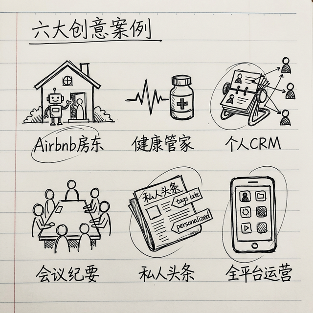
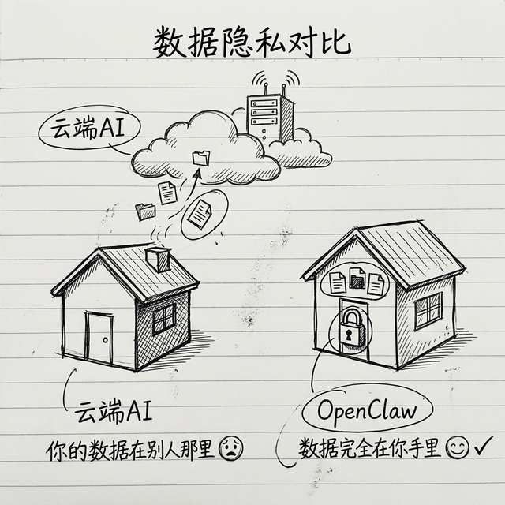

# 社区里最有创意的 6 个玩法：看看别人都怎么玩

前面两章我们说了实用场景，但 OpenClaw 的玩法远不止那些。社区里的小龙虾玩家们真的很有创意——我从 Reddit r/openclaw、GitHub、掘金等社区搜集了 6 个特别有意思的真实案例，每一个都能给你启发。



你不用全做，看看有没有哪个戳中你的需求，有的话就试试。

---

## 案例一：Airbnb 房东助手——让 AI 帮你接待客人

有一位 Reddit 用户分享了他的玩法：他在做 Airbnb 房东，每天要回复大量客人的重复性问题——"WiFi 密码是什么""退房时间是几点""附近有什么好吃的"……他用 OpenClaw 搭了一个自动回复系统。

### 它能帮你做什么？

- 客人通过消息问常见问题 → AI 自动回答（WiFi、门锁密码、退房规则、附近推荐等等）
- 遇到它答不了的问题（退款、投诉等） → 自动转给你本人处理
- 新客人入住前 → 自动发送入住指南
- 客人退房后 → 自动发送感谢消息和评价提醒

### 你需要什么技能？

- `tavily-search` —— 帮客人搜附近的餐厅、景点
- `web-browsing` —— 查实时信息（比如当地天气）

### 你可以对它说

> "帮我写一份入住指南，包含 WiFi 密码、门锁密码、附近超市和推荐餐厅，存成一个模板，每次新客人来了自动发。"

### 为什么有启发性？

这个案例把 AI 从"帮你干活"变成了**帮你接待客人**——AI 直接面对你的用户了。不光是 Airbnb，做小生意的、有客服需求的朋友都可以借鉴这个思路。

---

## 案例二：健康数据追踪——你的私人健康管家

有社区用户分享了用 OpenClaw 做"健康数据管家"的案例：把体检报告、用药记录、运动数据都交给 AI 管理，还能生成健康趋势分析。

### 它能帮你做什么？

- 你体检完了 → 拍照发给它，它帮你提取关键指标（血压、血糖、胆固醇等），存到记录里
- 到了吃药时间 → 它提醒你（用定时任务实现）
- 每周生成一个健康小报告 → 告诉你哪些指标有变化、需不需要注意
- 你想健身 → 它根据你的身体情况和目标帮你制定计划

### 你需要什么技能？

- `summarize` —— 读懂体检报告
- `weather` —— 结合天气推荐运动方案

### 你可以对它说

> "帮我把这张体检报告里的关键指标提取出来，和上次的对比一下，看看有什么变化。"

> "我想减脂，体重 75 公斤，目标 70 公斤，帮我做一个四周的运动计划。"

### 为什么有启发性？



健康数据是非常私密的，你不太想交给云端 AI。OpenClaw 跑在你自己电脑上，数据完全在你手里——**这正是自托管最大的价值**。这类"隐私敏感"的场景，是 OpenClaw 相比其他 AI 工具最大的优势。

---

## 案例三：个人 CRM——记住每一个重要的人

CRM 是 Customer Relationship Management 的缩写，企业用来管客户关系的。但是个人也可以用——**管你的人脉**。

有社区用户分享了他的"个人 CRM"玩法：每次见了一个人、聊了一个天，他都会告诉 AI 记下来。

### 它能帮你做什么？

- 记住每个联系人的背景信息：在哪个公司、做什么工作、你们是怎么认识的
- 记住上次聊天内容："上次他说他们公司在做 XX 项目"
- 生日/重要日子提醒："张三生日是下周，要不要发个消息？"
- 找人脉："我有认识做跨境电商的人吗？帮我查一下"

### 你需要什么技能？

- 这个场景不需要特别的技能！OpenClaw 的**记忆系统**本身就够用了——你告诉它的信息，它会记在 `memory/` 里面

### 你可以对它说

> "记一下，今天认识了李四，是 XX 公司的产品总监，通过马力介绍认识的，人很好，对 AI 很感兴趣。"

> "下个月我要去深圳出差，帮我看看我认识的人里有没有在深圳的？"

### 为什么有启发性？

这个案例展示了 OpenClaw **记忆系统**的真正价值——它不只是帮你做事，还帮你**记住事**。你认识的每一个人、每一次重要交流，AI 都能帮你记着。时间越长，这个"人脉数据库"越值钱。

---

## 案例四：会议纪要自动化——开完会就有行动项

开会最头疼的是什么？不是开会本身，是**会后整理纪要**。谁说了什么、定了什么结论、谁负责什么、截止日期是哪天……整理起来比开会还累。

社区里有人分享了这个玩法：把会议的录音或者转写文字丢给 OpenClaw，它自动帮你整理成结构化的纪要。

### 它能帮你做什么？

- 把一大段会议记录 → 整理成"讨论了什么""结论是什么""谁负责什么""截止日期"
- 自动提取行动项 → 变成待办清单
- 发给参会的人 → 每个人都清楚自己要做什么

### 你需要什么技能？

- `summarize` —— 长文本总结
- 如果你用 Notion → `notion` 技能可以自动把待办写进去

### 你可以对它说

> "这是今天 10 点会议的文字记录，帮我整理成会议纪要。格式要求：讨论要点、决策结论、行动项（负责人+截止日期）。"

### 为什么有启发性？

这个场景的关键在于：**AI 不只是总结，它还在帮你提取结构化信息**——从一堆文字里拎出谁该干什么。这个能力延伸出去可以做很多事：比如从一通电话录音里提取客户需求，从一篇采访稿里提取关键观点。

---

## 案例五：个性化新闻聚合——你的"私人头条"

你每天早上看新闻是什么流程？打开好几个 APP，刷一堆不相关的内容，真正有用的可能就两三条。

社区有人做了一个"私人头条"——让 OpenClaw 每天按照**你的兴趣**，从多个渠道搜集新闻，整理成一份简报。

### 它能帮你做什么？

- 每天早上自动搜索你关心的领域（比如 AI、新能源汽车、跨境电商）
- 从 Reddit、Hacker News、X（Twitter）、微信公众号等多个来源搜集
- 去重、排序、总结 → 生成一份定制简报
- 如果某个话题有重大动态 → 立刻通知你，不等到早上

### 和晨间简报有什么区别？

晨间简报是"天气 + 日程 + 待办 + 新闻"的综合简报，这个是**专门针对新闻的深度定制版**——你可以细化到只追踪特定公司、特定话题、特定领域。

### 你需要什么技能？

- `tavily-search` —— 搜索新闻
- `web-browsing` —— 浏览特定网站
- `summarize` —— 总结文章

### 你可以对它说

> "帮我搜索今天 AI 领域有什么重要新闻和动态，只看靠谱来源（不要营销号），总结成 5 条以内，每条不超过 100 字。"

### 怎么设置自动化？

用定时任务，每天早上自动跑：

```json
"crons": {
  "personalized-news": {
    "schedule": "0 7 * * *",
    "prompt": "搜索以下领域今天的重要新闻：1) AI 和大模型 2) 新能源汽车 3) 半导体芯片。每个领域最多 3 条，来源必须靠谱。整理成简报发给我。"
  }
}
```

### 为什么有启发性？

这个案例展示了 OpenClaw 的**主动服务**能力——不是你问它才干活，是它到点了自己干活，然后把结果送到你面前。这才是真正的"助理"体验。

---

## 案例六：社交媒体自动运营——一条内容发全平台

做自媒体最累的是什么？**同一个内容要发到五六个平台，每个平台的风格还不一样**。小红书要精致、抖音要抓眼球、X 要简洁、公众号要深度……一份内容反反复复改格式，特别累。

社区里有自媒体博主分享了他的玩法：写一份内容，让 OpenClaw 自动改编成各平台的版本。

### 它能帮你做什么？

- 你写一篇文章或者一个想法 → AI 变出多个版本：
  - 小红书版：带 emoji，精致、种草感
  - 抖音口播版：200 字以内，开头抓人
  - X/推特版：一句话精华，中英文各一版
  - 公众号版：深度、有逻辑、适合长阅读
- 自动生成每周的内容排期
- 帮你追热点："最近这个话题在 X 上很火，要不要追一篇？"

### 你需要什么技能？

- `tavily-search` —— 搜热点、搜参考文章
- `web-browsing` —— 浏览竞品内容、看现在什么火
- `spell-check-cn` —— 发布前检查一遍错别字

### 你可以对它说

> "我写了一篇关于 AI 提效的文章，帮我改成以下几个版本：1) 小红书笔记，带 emoji，300 字以内；2) 抖音口播文案，200 字，开头要抓人；3) X 推文，一句话精华，中英文各一版。"

### 进阶玩法

配合 n8n 工作流（上一章提到的），你甚至可以做到：

> 你在 Notion 写完一篇文章 → 自动触发 → OpenClaw 生成多平台版本 → n8n 自动发布到各平台

完全不用你手动操作，写完就等着上线。

### 为什么有启发性？

这个案例把 AI 从"帮你写一篇文章"升级成了**帮你运营整个内容管道**。一次输入、多次输出，效率提升不是一倍两倍，是好几倍。

---

## 小结：关键不是技术，是想象力

这 6 个案例有一个共同点：**它们用到的技能都很基础**——搜索、总结、记忆、定时任务——但是因为使用者有好的想法，就做出了很有意思的应用。

所以 OpenClaw 最厉害的地方不在于技术有多深，而在于——**你有什么想法，它就能帮你实现什么**。

如果你有什么好玩的玩法，欢迎分享到 GitHub Discussions 或者 Reddit r/openclaw 社区，让大家都看看。

下一章我们来看进阶玩法，更有意思，更强大。

---
