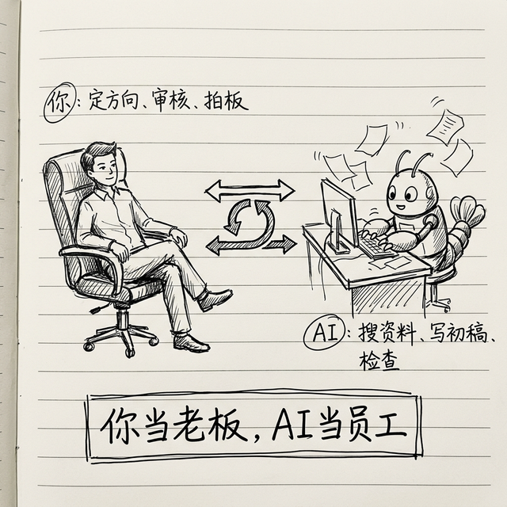

# 项目实战：我们一起用 OpenClaw 写一本书

你现在正在看的这本书，就是**用 OpenClaw 协作写出来的**。这一章我把整个过程原原本本记录下来，你可以照着做——不光是写书，写文章、写方案、做研究报告，都可以用这个方法。

## 为什么要讲这个？

因为"怎么用"比"有什么功能"更重要。前面说了这么多功能，你可能还是不确定：**到底应该怎么和 AI 配合？我负责什么？AI 负责什么？**

这一章就是用一个完整的真实案例，帮你把这个问题彻底搞清楚。

---

## 整个过程分几步？

一共五步。我一步步给你讲，每一步我都告诉你"人做了什么"和"AI 做了什么"。

### 第一步：想清楚要做什么（人负责）

做什么事情之前，先把方向想好——这是你的责任，AI 帮不了你做这个决定。

马力定下的方向是：
- **目标**：写一本给普通人看的 OpenClaw 零基础入门书
- **读者**：不懂技术的普通人，能打开终端、会复制粘贴命令就行
- **风格**：轻松口语化，像朋友聊天一样，不用专业术语

这些方向性的东西，一定是**你来定**的。AI 可以帮你分析市场、提供建议，但最后拍板的人是你。

### 第二步：市场调研，找到差异化（AI 帮你干苦力）

方向定了，接下来要搞清楚：现在市面上已经有什么了？我们的东西有什么不一样？

这一步我们让 AI 帮忙搜索。你可以这样对它说：

> "帮我搜索一下，现在网上已经有哪些 OpenClaw 的教程和书？列出来，分析一下它们各自的优缺点。"

AI 用 tavily-search 搜索了一圈，给我们整理了一份分析报告。搜索结果发现：

- ✅ 已有教程数量不少，但**大多数面向开发者**，充满专业术语
- ✅ 很多教程更新不及时，项目迭代太快，命令经常过期
- ❌ **几乎没有面向非技术普通人的入门教程**

这就是我们的差异化定位：**专门给普通人写，通俗易懂，先讲原理后讲操作**。

> 💡 这就是 AI 最擅长的事情：帮你**搜集和整理信息**。你如果自己做，打开十几个网页一篇篇看，至少花两个小时。让 AI 做，几分钟就给你整理好了。

### 第三步：规划大纲（人拍板 + AI 帮忙想）

确定了定位，接下来规划大纲。你可以这样说：

> "我要写一本面向零基础普通人的 OpenClaw 入门书。请帮我列一个大纲，遵循'从通用到具体、从原理到实践'的逻辑。"

AI 会给你出一版大纲。你看了之后可以说：

> "不错，但是第四部分展开一下，技能这块单独分三章。"

它改完再给你看，你再调整，来回几轮，大纲就定了。

我们最终确定的六大部分：

1. **AI 智能体基础**（先懂原理，后面学操作才快）
2. **认识 OpenClaw**（它是什么、架构、记忆系统）
3. **安装配置上手**（一步步跟着走）
4. **技能系统**（OpenClaw 的灵魂）
5. **实际场景和玩法**（入门+进阶）
6. **排错和安全**（出了问题怎么办）

### 第四步：一章一章写（AI 写初稿 + 你审核修改）

这是最重要的一步：**写作**。

我们的分工是这样的：

**每一章的流程：**
1. 我给 AI 一个明确的指令（Prompt），比如：

> "现在写第二章《什么是 AI 智能体》。目标读者是不懂技术的普通人。要求：
> - 用大白话讲，不用专业术语，遇到必须提的术语要解释清楚
> - 多用生活化的比喻和例子
> - 语气轻松，像朋友聊天
> - 结构清晰，多用小标题
> - 长度控制在 2000-3000 字"

2. AI 写出初稿
3. 我阅读初稿，修改我不满意的地方
4. 有些地方需要 AI 补充或者重写，我会说"这个部分再展开一些"或者"这个例子换一个更好懂的"
5. 改到我满意，这一章就算完了

> 💡 **关键：你给 AI 的指令越具体，它写出来的东西就越好。** 不要只说"帮我写一章"，要说清楚目标读者是谁、风格要求是什么、长度多少、有什么特殊要求。指令越清楚，返工越少。

### 第五步：整理收尾，提交发布

所有章节写完了：

- 用 `spell-check-cn` 检查一遍错别字
- 用 `markdown-toc` 生成完整目录
- 用 GitHub 管理版本（每写完一章就提交一次，这样有版本记录）
- 最终发布到 GitHub 开源

---

## 我们的分工表

| 步骤 | 人做了什么 | AI 做了什么 |
|------|-----------|------------|
| 定方向 | ✅ 定位、目标读者、风格 | 提供市场分析建议 |
| 市场调研 | 看结论、做判断 | ✅ 搜索整理竞品分析 |
| 规划大纲 | ✅ 审核、调整、拍板 | 出初版大纲 |
| 写每一章 | ✅ 审核修改、把控质量 | ✅ 搜资料、写初稿 |
| 整理发布 | 最终审核 | ✅ 检查错字、生成目录 |

**一句话总结：你当项目经理把控方向和质量，AI 出力搜资料写内容，配合默契效率极高。**

---

## 你也可以用这个方法做什么？

写书只是一个例子。同样的方法，你还能做这些事情：

### 想法一：写一个专题研究报告

比如你想研究"新能源汽车行业趋势"：
1. 让 AI 帮你搜集最新的行业数据和报告
2. 你定好分析框架（从哪些维度分析）
3. AI 帮你写出每个板块的内容
4. 你审核修改，加入你自己的见解

### 想法二：写一套培训教材

比如你公司新来了人，需要一套入职培训手册：
1. 你列出需要培训的知识点
2. 让 AI 帮你把每个知识点展开成通俗易懂的教程
3. 你检查内容正确性，加入公司特有的信息

### 想法三：做一个知识星球 / 付费专栏

你某个领域有专长，想做一系列付费内容：
1. 用晨间简报 + 市场调研的场景帮你发现选题
2. 用内容创作流水线帮你高效产出
3. 你把控质量和专业度，AI 帮你提升效率

---

## 最重要的一个建议

不管你做什么项目，记住一点：

> **AI 是你的助手，不是你的替代品。方向是你的，质量是你把控的，AI 帮你加速。**

就像这本书——如果我不把控方向和质量，交给 AI 自己随便写，出来的东西一定不行。但是有了 AI 帮忙搜资料、写初稿，**我的效率确确实实提高了好几倍**。

这就是人和 AI 最好的协作方式：**你当老板，AI 当员工，各司其职。**

好了，实战案例讲完了，下一章我们说排错——出了问题怎么办。

---
