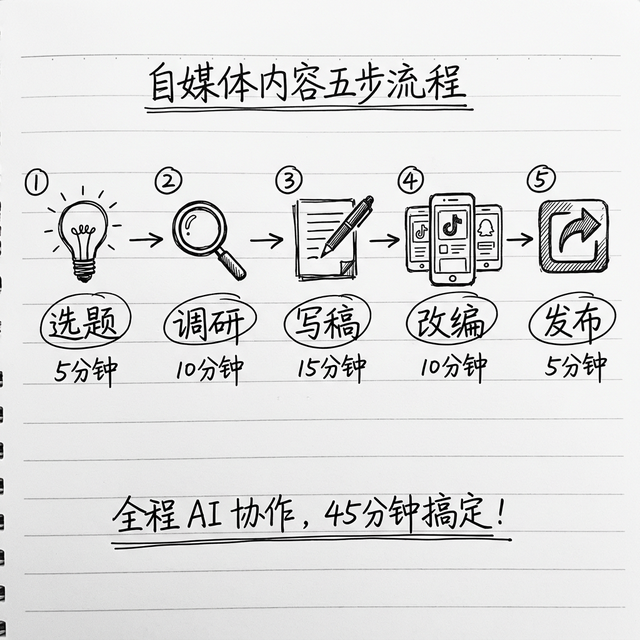

# 自媒体全流程自动化：从选题到分发

你做自媒体最头疼的是什么？不是写不出来，而是**流程太长太碎**——选题要灵感，调研要时间，写稿要精力，改编要耐心，发布要一个平台一个平台手动操作……

这一章我教你用 OpenClaw 把自媒体全流程自动化。不是完全交给 AI（那样质量不行），而是**你把控方向和质量，AI 帮你跑流程**。

---

## 全流程概览



```
选题调研 → 资料搜集 → 写初稿 → 多平台改编 → 排期发布
```

下面我一步一步教你，你照着做就行。

---

## 开始之前：确认你装了这三个技能

在终端里输入以下命令，确认核心技能已经安装：

```bash
clawhub install tavily-search
clawhub install summarize
clawhub install web-browsing
```

> 💻 **Windows 用户：** 同样的命令，在 PowerShell 里输入即可。

已经装过的不会重复安装，没装的会自动帮你装。这三个就够跑完整个流程了。

---

## 第一步：让 AI 帮你选题（5 分钟）

打开 OpenClaw 聊天窗口，把下面这段话**复制粘贴**进去（把括号里的内容换成你自己的）：

> "我做的是（你的领域，比如马力做的"AI 效率提升"）方向的自媒体。帮我做以下事情：
> 1. 搜索这个领域今天有什么热门话题
> 2. 看看知乎、36kr 相关话题下讨论最多的是什么
> 3. 给我推荐 3 个今天适合写的选题，每个写一句话说明为什么值得写"

**你会收到什么？** AI 会给你一个列表，包含 3 个选题建议和每个选题的热度分析。你挑一个你最有感觉的。

---

## 第二步：让 AI 帮你做调研（10 分钟）

选好题之后，把下面这段话**复制粘贴**进去（把"选题"换成你刚选的）：

> "我决定写这个选题：（你选的选题）。请帮我做调研：
> 1. 搜索这个话题最近一个月的热门文章，至少找 5 篇
> 2. 打开其中最好的 2-3 篇，完整阅读
> 3. 整理出这些文章的核心角度、关键数据、亮点金句
> 4. 最后帮我列一个文章大纲，包含标题建议（3 个备选）"

**你会收到什么？** 一份完整的调研报告 + 文章大纲。AI 会自动调用搜索技能找文章、浏览器技能读全文、总结技能提炼要点。

> 💡 **这一步是最省时间的。** 以前你自己做调研可能要花 1-2 小时翻资料，现在 10 分钟搞定。

---

## 第三步：让 AI 写初稿（5 分钟）

调研完了，**直接接着对话**（不要开新会话，这样 AI 记得刚才的调研结果），说：

> "根据刚才的调研资料和大纲，帮我写一篇文章：
> - 用第一个标题方案
> - 开头 3 句话要勾住读者
> - 核心观点 3 个，每个配一个例子或数据
> - 结尾给一个行动建议
> - 语气口语化，像朋友聊天，不要太正经
> - 全文 1500 字左右"

**你会收到什么？** 一篇完整的初稿。

> ⚠️ **关键提醒：初稿一定要自己改！** AI 写的东西结构和信息可以参考，但你的个人风格、独特观点、真实经验，是 AI 写不出来的。**初稿让 AI 出，灵魂由你来赋。** 建议至少花 15-20 分钟改稿，加入你自己的故事和观点。

---

## 第四步：一键改编成多平台版本（3 分钟）

改完稿之后，把你修改好的文章发给 AI，然后说：

> "这是我改好的文章（粘贴你的文章）。帮我改编成以下 4 个版本：
> 
> 1. **小红书版**：300 字以内，带 emoji，前三行要勾人，口语化，像闺蜜聊天
> 2. **抖音口播版**：200 字以内，用问句开头，语气夸张一点，适合对着镜头念
> 3. **公众号版**：保留完整内容，加小标题分段，开头加引导关注
> 4. **X/推特版**：一句话精华，140 字以内"

**你会收到什么？** 4 个不同版本的内容，每个都针对平台特点做了调整。你检查一下，满意就直接发布。

---

## 第五步：设置自动化（进阶，可选）

如果你想让上面的流程**每天自动跑**，可以设置定时任务。

**方法：** 打开配置文件：
- macOS / Linux：`~/.openclaw/openclaw.json`
- Windows：`%USERPROFILE%\.openclaw\openclaw.json`

在定时任务部分加上：

```json
"daily-content": {
  "schedule": "0 20 * * *",
  "prompt": "搜索 AI 效率提升领域今天的热门话题，选一个最佳选题。搜索相关资料做调研，然后写一篇 1500 字的初稿，改编成小红书和抖音两个版本。把三个版本都保存到 ~/Documents/content/ 文件夹，文件名用明天的日期。"
}
```

> 💡 **`"0 20 * * *"` 是什么意思？** 就是"每天晚上 8 点"自动执行。这样每天晚上 AI 帮你准备好明天的内容，第二天早上你起来改改就能发。

**别忘了先创建保存文件的文件夹：**

```bash
mkdir -p ~/Documents/content
```

> 💻 **Windows 用户：** `New-Item -ItemType Directory -Force -Path "$HOME\Documents\content"`

---

## 进阶玩法：内容改编技能（一劳永逸）

如果你经常做多平台改编，可以专门写一个技能，以后一句话就搞定。

**第 1 步：** 在终端输入：

```bash
mkdir -p ~/.openclaw/skills/content-remix
```

> 💻 **Windows 用户：** `New-Item -ItemType Directory -Force -Path "$HOME\.openclaw\skills\content-remix"`

**第 2 步：** 用 VS Code 打开这个文件：

```bash
code ~/.openclaw/skills/content-remix/SKILL.md
```

> 💻 **Windows 用户：** `code "$HOME\.openclaw\skills\content-remix\SKILL.md"`

**第 3 步：** 把下面的内容**复制粘贴**进去，保存：

```markdown
---
name: "content-remix"
description: "一份内容自动改编为多个平台的版本"
tags: ["内容创作", "自媒体"]
---

# 多平台内容改编技能

## 触发条件
当用户说"帮我多平台改编"或者"帮我改编成多个版本"时触发

## 执行步骤
1. 阅读用户提供的原始内容，理解核心观点
2. 生成以下版本：
   - 小红书版：300 字以内，带 emoji，口语化，前三行抓人
   - 抖音口播版：200 字以内，问句开头，适合对镜念
   - 公众号版：完整深度版，加小标题分段
   - X/推特版：一句话精华，中英文各一版
3. 每个版本附上 3 个推荐的话题标签

## 注意事项
- 保持原文核心观点不变
- 根据每个平台的调性调整语气
- 先出草稿让用户确认
```

**第 4 步：** 保存后，以后你只要对 AI 说：

> "帮我把这篇文章多平台改编"

它就会自动按照你定义的格式，输出 4 个版本。**一劳永逸。**

---

## ⚠️ 重要提醒

1. **AI 是工具不是替代品**：AI 帮你提效，但你的**独特观点、个人经历、审美品味**是不可替代的。100% AI 生成的内容，读者是能感觉到的
2. **一定要人工审核**：发出去之前必须自己过一遍，检查事实准确性、语气、个人风格
3. **平台规则**：部分平台对 AI 生成内容有政策限制，请了解你发布平台的规定

---

## 省时间计算

| 步骤 | 传统做法 | 用 OpenClaw | 你的角色 |
|------|:---:|:---:|:---:|
| 选题 | 30-60 分钟 | 5 分钟 | 拍板选哪个 |
| 调研 | 1-2 小时 | 10 分钟 | 判断信息质量 |
| 写稿 | 2-3 小时 | 5 分钟出初稿 + 20 分钟改 | 注入灵魂和观点 |
| 改编 | 30-60 分钟 | 3 分钟 | 审核调整 |
| **总计** | **4-6 小时** | **约 45 分钟** | |

**你当老板把控方向，AI 当员工跑流程。** 这就是 OpenClaw 在自媒体场景里最好的用法。

---
