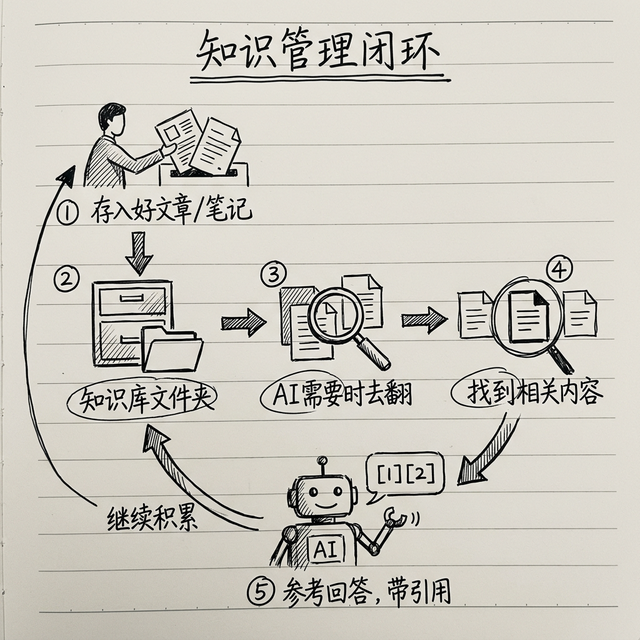

# 打造你的知识管理系统：零代码 RAG 实战

你有没有这种感觉：看过的好文章记不住，收藏了一堆链接从来不看，有用的知识散落在各处——微信收藏里一些、浏览器书签里一些、笔记本里一些——用的时候找不到？

这一章教你用 OpenClaw 搭建一个**个人知识管理系统**——所有你看过的好东西，AI 帮你记着，你想用的时候问一句就行。

---

## 核心原理：什么是 RAG？



> 💡 **RAG 是什么？** RAG 全称 Retrieval-Augmented Generation，翻译过来就是"检索增强生成"。你不用记这个名字，**一句话理解就是：AI 回答你问题之前，先去你的资料库里翻一翻，找到相关的内容，再综合回答你**。

这就是为什么 RAG 重要：没有 RAG 的 AI 只知道它训练数据里的东西；有了 RAG 的 AI，能额外知道**你存进去的所有东西**。

好消息是，OpenClaw 内置了 RAG 功能，你不需要写一行代码。

---

## 第一步：建立你的知识库

OpenClaw 的知识库就是 `knowledge/` 文件夹。你把文件丢进去，AI 就能读。

### 支持的文件格式

- Markdown 文件（`.md`）—— 最推荐
- 文本文件（`.txt`）
- PDF 文件
- Word 文档
- 你整理的任何笔记

### 创建知识库——照着做

打开终端，**逐行输入**以下三条命令（每输一行按一次回车）：

```bash
mkdir -p ~/.openclaw/knowledge/articles
```

```bash
mkdir -p ~/.openclaw/knowledge/notes
```

```bash
mkdir -p ~/.openclaw/knowledge/references
```

> 💻 **Windows 用户：** 打开 PowerShell，输入：
> ```powershell
> New-Item -ItemType Directory -Force -Path "$HOME\.openclaw\knowledge\articles"
> New-Item -ItemType Directory -Force -Path "$HOME\.openclaw\knowledge\notes"
> New-Item -ItemType Directory -Force -Path "$HOME\.openclaw\knowledge\references"
> ```

> 💡 **不想用终端？** 你也可以用文件管理器操作：  
> - **macOS**：按 `Command + Shift + .` 显示隐藏文件 → 打开用户目录 → `.openclaw` 文件夹 → 新建三个文件夹  
> - **Windows**：地址栏输入 `%USERPROFILE%\.openclaw\` → 新建 `knowledge` 文件夹 → 在里面建三个子文件夹

**验证一下：** 输入这条命令，确认文件夹建好了：

```bash
ls ~/.openclaw/knowledge/
```

> 💻 **Windows 用户：** `dir "$HOME\.openclaw\knowledge\"`

你应该看到 `articles`、`notes`、`references` 三个文件夹。

每个子文件夹的用途：

- `articles/` —— 你看过的好文章
- `notes/` —— 你自己的笔记
- `references/` —— 参考资料、手册、说明书等

---

## 第二步：把好内容自动入库

手动往知识库里存文件当然可以，但更聪明的做法是**让 AI 自动帮你存**。

### 方法一：看到好文章，一句话收藏

> "帮我把这篇文章保存到知识库里：https://xxx.com/article"
> 
> AI 会自动：打开链接 → 提取正文 → 总结核心内容 → 保存为 Markdown 文件到 knowledge/articles/

### 方法二：定时自动收集

设置一个定时任务，每天自动帮你收集特定领域的好内容：

```json
"knowledge-collector": {
  "schedule": "0 21 * * *",
  "prompt": "搜索今天关于 AI 和产品管理领域的优质文章。选出最有价值的 3 篇，提取核心内容，保存到 knowledge/articles/ 文件夹，文件名用日期+标题。"
}
```

### 方法三：对话中自动学习

OpenClaw 的记忆系统会自动把你们对话中的重要信息记住。但如果你想更主动地管理：

> "把我们刚才讨论的关于竞品分析的内容，整理成一份笔记，保存到知识库里"

---

## 第三步：从知识库里检索

知识存进去了，怎么用？直接问就行：

> "我之前看过一篇关于 AI 定价策略的文章，帮我找一下，核心观点是什么？"
> 
> "上次我们讨论的关于新能源汽车市场的数据，帮我调出来"
> 
> "把我知识库里所有关于「用户增长」的内容整理一下，给我一个总结"

AI 会自动搜索你的知识库，找到相关内容，综合回答你。

---

## 第四步：Obsidian + OpenClaw 联动

如果你用 Obsidian（一个很受欢迎的笔记软件）管理笔记，可以把 Obsidian 的 vault（仓库）和 OpenClaw 的知识库打通。

### 怎么做？

最简单的方法：把 OpenClaw 的 knowledge 文件夹指向你的 Obsidian vault。

在 `openclaw.json` 里配置：

```json
{
  "knowledge_paths": [
    "~/Documents/ObsidianVault"
  ]
}
```

这样 AI 就能读取你 Obsidian 里的所有笔记了。你在 Obsidian 里记的东西，AI 都知道。

### 实战案例

> "从我的笔记里找找，我之前关于「商业模式画布」写过哪些笔记？"
>
> "结合我 Obsidian 里关于竞品分析的笔记，帮我更新一下这份报告"
>
> "帮我在 Obsidian 里创建一个新笔记，总结今天的讨论重点"

---

## 实战案例：用 AI 做读书笔记

每看完一本书，你可以这样做：

1. **读书时**：随手把有感触的段落发给 AI
   > "这段很有价值，帮我记下来"

2. **读完后**：让 AI 整理
   > "帮我把这本书的所有笔记整理成一份读书笔记，包含核心观点、金句摘录、我的思考"

3. **日后使用**：当你写文章或者做决策需要参考时
   > "我之前读过一本关于定价的书，里面有个'锚定效应'的例子，帮我找出来"

---

## 知识库维护小贴士

1. **定期清理**：每个月花 10 分钟看看知识库，删掉过时或者不需要的内容
2. **统一格式**：文件名用「日期-标题」格式，比如 `20XX-01-15-AI定价策略.md`
3. **打标签**：在文件开头加几个关键词标签，方便 AI 检索
4. **别贪多**：质量比数量重要，一篇高质量的总结比十篇没看过的收藏有价值得多

---

## 小结

| 功能 | 怎么做 |
|------|--------|
| 建知识库 | 创建 `knowledge/` 文件夹，按分类建子目录 |
| 自动入库 | 看到好文章一句话收藏，或设置定时自动收集 |
| 检索使用 | 直接用自然语言问 AI |
| Obsidian 联动 | 配置 knowledge_paths 指向 vault |

**你的 AI 助手只有在知道得足够多的时候，才能给出足够好的回答。** 知识库就是它的"脑容量"——你存得越多、质量越高，它就越聪明。

---
