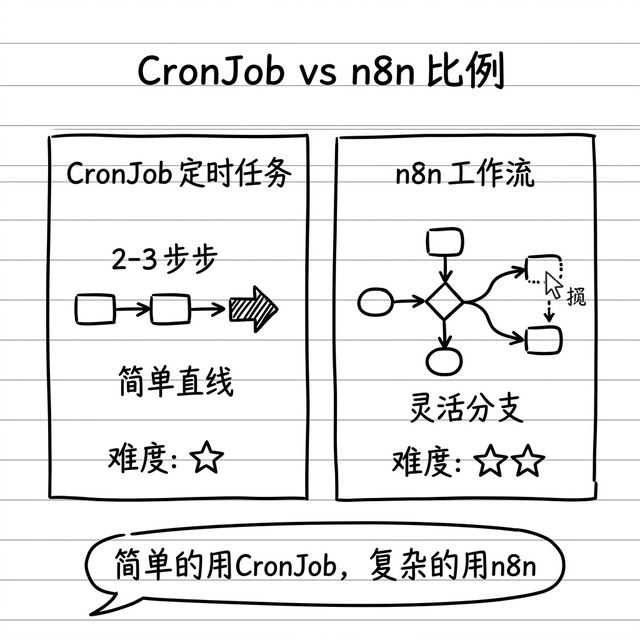
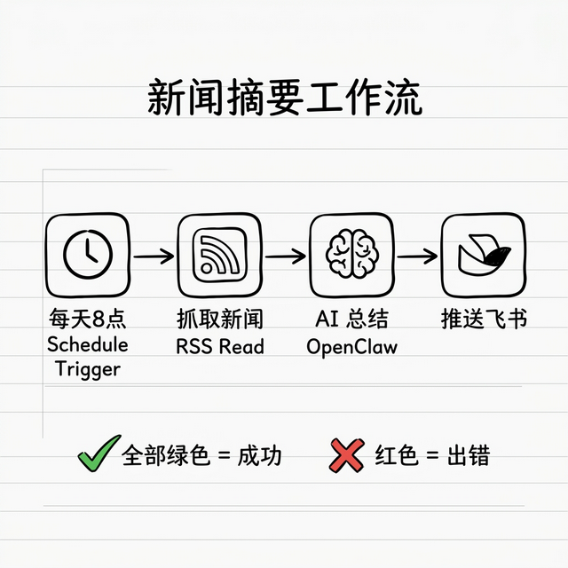

# 跨平台工作流自动化：n8n 集成实战

前面几章我们多次提到 n8n，这一章终于要把它讲透了。

n8n 是一个开源的自动化工具，可以把你用的各种工具和服务"串"起来，实现复杂的自动化流程。和 OpenClaw 搭配，威力更大。

> 💡 **这一章稍微有一点门槛**，涉及到 Docker 安装和可视化界面操作。如果你只用 OpenClaw 自带的定时任务就够用了，可以先跳过这一章。等你觉得自带的定时任务不够灵活了，再回来看。

---

## n8n 是什么？一句话说清楚

> **n8n = 一个可视化的"工作流搭建器"，帮你把不同的工具和服务串起来自动干活。**

你可以把它理解为"超级版的快捷指令"——但是支持 600 多种工具和服务，而且有拖拽式的图形界面。

**和 OpenClaw 的定时任务（CronJob）有什么区别？**

| | CronJob | n8n |
|---|---|---|
| 适合 | 简单定时任务 | 复杂多步骤流程 |
| 条件判断 | 不太方便 | 很方便（如果A就B，否则C） |
| 可视化 | 没有 | 有图形界面，像流程图 |
| 连接器 | 通过技能 | 自带 600+ |
| 上手难度 | 低 | 中 |

简单说：**简单任务用 CronJob 就够了，复杂流程才需要 n8n。**



---

## 手把手教你安装 n8n

### 第 1 步：安装 Docker Desktop

n8n 需要 Docker 来运行。Docker 就是一个"容器工具"——把软件打包在一起，一条命令就能跑。

**安装方法：**

1. 打开浏览器，访问 https://www.docker.com/products/docker-desktop/
2. 下载适合你系统的版本（Mac / Windows）
3. 双击安装包，跟着提示安装
4. 安装完成后，打开 Docker Desktop（在你的应用列表里）
5. 等它启动完成（任务栏/状态栏出现一个鲸鱼图标就是好了）

**验证是否安装成功：** 打开终端，输入：

```bash
docker --version
```

如果输出了版本号（比如 `Docker version 25.0.0`），就是安装成功了。

> ⚠️ **Docker Desktop 必须先"打开运行"，终端命令才有用！** 这点新手最容易忽略：你安装完 Docker Desktop 后，**一定要先在应用列表（macOS 启动台 / Windows 开始菜单）里双击打开它**，等到屏幕右上角（macOS）或右下角（Windows）出现一个**小鲸鱼图标 🐳**，再去终端输入 docker 命令。否则你会看到类似 `Cannot connect to the Docker daemon` 的报错——这不是你电脑坏了，只是 Docker 还没启动而已。

> 💡 **安装 Docker 需要你的电脑满足这些条件：** macOS 12 以上 / Windows 10 以上，至少 4GB 内存。基本上近几年买的电脑都 OK。

---

### 第 2 步：一条命令安装 n8n

在终端里输入这一行命令，回车：

```bash
docker run -d --name n8n --restart=always -p 5678:5678 -v ~/.n8n:/home/node/.n8n n8nio/n8n
```

> 💡 **这条命令在干什么？** 一个个说：
> - `docker run`：用 Docker 运行一个软件
> - `-d`：在后台运行（不占用你的终端窗口）
> - `--name n8n`：给它起个名字叫 n8n
> - `--restart=always`：电脑重启后自动启动 n8n
> - `-p 5678:5678`：让你通过 5678 端口访问
> - `-v ~/.n8n:/home/node/.n8n`：把配置和数据保存在你电脑上（这样即使重装 n8n 也不会丢数据）
> - `n8nio/n8n`：要运行的软件名字

等几分钟，它会下载 n8n 的镜像（大概几百 MB，取决于网速）。

---

### 第 3 步：打开 n8n 界面

下载完成后，打开浏览器，访问：

```
http://localhost:5678
```

你会看到 n8n 的注册页面。设置一个用户名和密码（这是你的 n8n 管理密码，和 OpenClaw 无关）。

注册完登录，你会看到一个干净的界面——欢迎进入 n8n 的世界！

---

### 第 4 步：在 OpenClaw 里安装 n8n 技能

回到终端，输入：

```bash
clawhub install n8n-workflow
```

这样 OpenClaw 就能和 n8n 通信了。

---

## 手把手搭建第一个工作流：每日新闻摘要



下面我带你搭一个实用的工作流：**每天早上自动收集新闻，AI 帮你总结，推送到飞书**。

### 第 1 步：打开 n8n，新建工作流

1. 在 n8n 界面（http://localhost:5678），点击右上角 **"+ New Workflow"**
2. 给它起个名字，比如"每日新闻摘要"

### 第 2 步：添加定时触发器

1. 点击界面中间的 **"+"** 号
2. 搜索 **"Schedule Trigger"**（定时触发）
3. 点击添加
4. 设置触发时间：
   - **Trigger Interval**: Custom (Cron)
   - **Cron Expression**: `0 8 * * *`（每天早上 8 点）
5. 点击 **"保存"**

### 第 3 步：添加 RSS 新闻源

1. 在 Schedule Trigger 节点右边，点 **"+"**
2. 搜索 **"RSS Read"**
3. 点击添加
4. 在 **URL** 里填入你想关注的新闻源，比如：
   - 36kr：`https://36kr.com/feed`
   - 少数派：`https://sspai.com/feed`
   - 你可以填任何支持 RSS 的网站
5. 点击 **"保存"**

### 第 4 步：添加 OpenClaw AI 总结

1. 在 RSS Read 节点右边，点 **"+"**
2. 搜索 **"HTTP Request"**（HTTP 请求）
3. 点击添加
4. 配置：
   - **Method**: POST
   - **URL**: `http://127.0.0.1:18789/api/chat`（这是你本地 OpenClaw 的 API 地址）
   - **Body Content Type**: JSON
   - **Body**: 
   ```json
   {
     "message": "请帮我总结以下新闻文章，提取核心要点，每条控制在 2 句话以内：\n\n{{ $json.content }}"
   }
   ```
5. 点击 **"保存"**

> 💡 **`{{ $json.content }}` 是什么意思？别慌，这不是代码。** 你可以把它想象成"快递传递"：上一步（RSS Read）拿到了新闻内容，打包放进了一个叫 `$json.content` 的快递箱。你在这里写 `{{ $json.content }}`，就是告诉 AI："拆开上一步传过来的快递箱，把里面的新闻内容拿出来总结一下。"**你不需要理解它的语法，照抄就行。**

### 第 5 步：添加飞书推送

1. 在 HTTP Request 节点右边，点 **"+"**
2. 搜索 **"Feishu"**（飞书）或 **"HTTP Request"**
3. 如果用飞书机器人 Webhook，选 HTTP Request，配置：
   - **Method**: POST
   - **URL**: 你的飞书群机器人的 Webhook 地址
   - **Body**:
   ```json
   {
     "msg_type": "text",
     "content": {
       "text": "📰 今日新闻摘要：\n\n{{ $json.response }}"
     }
   }
   ```

> 💡 **怎么拿飞书 Webhook 地址？** 打开飞书群 → 群设置 → 群机器人 → 添加自定义机器人 → 复制 Webhook 地址。

### 第 6 步：测试运行

1. 点击 n8n 界面右上角的 **"▶ Execute Workflow"**（执行工作流）
2. 观察每个节点是否都变绿了（绿色 = 成功，红色 = 出错）
3. 如果有红色节点，点击它看看错误信息是什么

### 第 7 步：激活工作流

测试没问题后，打开右上角的 **"Active"** 开关。从明天开始，每天早上 8 点它就会自动跑了。

---

## 另外两个实用工作流思路

### 工作流 2：邮件 → 分类 → 自动处理

```
[新邮件触发] → [发送给 OpenClaw] → [AI 分类]
                                    ├→ 重要：转发到飞书通知你
                                    ├→ 普通：打标签归档
                                    └→ 垃圾：直接跳过
```

搭建方法和上面一样：Schedule Trigger 换成 Email Trigger，后面的逻辑类似。

### 工作流 3：表单提交 → AI 处理 → 自动回复

```
[表单提交] → [OpenClaw 分析问题] → [查找 FAQ 匹配]
                                   ├→ 能回答：自动发邮件回复
                                   └→ 不能回答：创建工单 + 通知你
```

配合上一章的客服系统一起用，效果更好。

---

## n8n 日常维护

### 查看 n8n 是否在运行

```bash
docker ps
```

如果看到 `n8n` 这一行，说明在运行。

### 停止 n8n

```bash
docker stop n8n
```

### 重新启动 n8n

```bash
docker start n8n
```

### 查看 n8n 日志（出问题的时候用）

```bash
docker logs n8n --tail 50
```

> 💡 `--tail 50` 的意思是只看最后 50 行日志，不会输出太多内容。

---

## ⚠️ 注意事项

1. **n8n 需要 Docker 一直运行**：关了 Docker Desktop，n8n 也会停。如果你关电脑了，下次开机 Docker Desktop 会自动启动（如果你设置了开机自启），n8n 也会自动启动（因为我们加了 `--restart=always`）
2. **安全**：不要把 n8n 的 5678 端口暴露到公网。如果只是你自己用，默认的 localhost 访问就够了
3. **先在 OpenClaw 里调试好 prompt**：在聊天里先试试 AI 的回答质量，满意了再接入 n8n。n8n 里调试 prompt 不方便

---

## 小结

| 步骤 | 做什么 | 难度 |
|------|--------|------|
| 1. 装 Docker | 下载安装 Docker Desktop | ⭐⭐ |
| 2. 装 n8n | 一条 `docker run` 命令 | ⭐ |
| 3. 装技能 | `clawhub install n8n-workflow` | ⭐ |
| 4. 搭工作流 | 在 n8n 界面拖拽节点 | ⭐⭐ |
| 5. 测试激活 | 点击执行，确认无误后开启 | ⭐ |

**n8n 是 OpenClaw 的最佳搭档**——OpenClaw 提供"智能大脑"，n8n 提供"自动化管道"。两者结合，你的自动化能力没有天花板。

---
