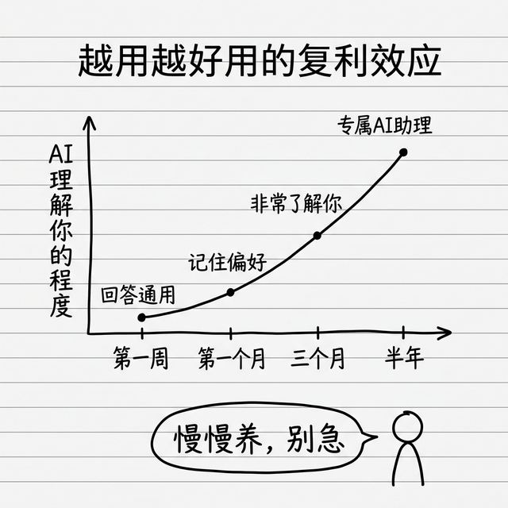

# 写在最后：享受复利，让 AI 慢慢懂你

这本书写到这里就结束了。最后几句话，和你说说心里话。

## OpenClaw 是个好工具，但它不是魔法

我见过两种极端：

一种人觉得"AI 什么都能干，以后我什么都不用做了"——期望太高了。另一种人觉得"AI 不就是个聊天机器人吗？能干啥？"——了解太少了。

真相在中间：**OpenClaw 是你的助理，不是你的替代品。** 它帮你做那些重复的、搜集的、整理的、按流程走的工作，把你的时间省出来，让你去做那些需要判断力和创造力的事情。

期望值对了，你玩起来会越来越开心。

## 它和别的 AI 最大的不同：越用越好用

这是 OpenClaw 最让我着迷的地方——**复利效应**。

普通的 AI 工具你今天用和一年后用，体验差不多。但 OpenClaw 不一样，因为它有记忆系统：

- 第一周：它还不太了解你，回答比较通用
- 第一个月：它开始记住你的偏好、你的项目、你的工作习惯
- 三个月后：它已经非常了解你了，你说"按老样子来"，它真的知道什么是"老样子"
- 半年后：它成了真正意义上的"专属AI助理"，懂你的人都不一定有它懂你

社区有人说过一句让我印象很深的话：

> "六个月后，你的小龙虾会知道你每天几点开始工作、喜欢什么格式的报告、讨厌别人说废话、正在推进三个什么项目，甚至知道你说'整理一下'到底是什么意思。"

这种**越用越好用的复利效应**，是其他工具给不了你的。所以不用急，不用一开始就追求完美，先跑起来，慢慢养。

## 回头看看，你已经学会了什么

让我帮你捲一桶——跑完这本书，你已经掌握了这些能力：

- ✅ 明白了 AI 智能体是什么、它的五大核心组件怎么工作
- ✅ 安装好了 OpenClaw，配置好了模型和聊天渠道
- ✅ 给 AI 设定了专属的性格和工作规则
- ✅ 会在 ClawHub 找技能、装技能、选技能
- ✅ 配置好了晨间简报、邮件管理、内容创作等实用场景
- ✅ 知道怎么排查问题、怎么保护安全

这些能力加在一起，你已经比 95% 的人更会用 AI 了。接下来就是多用、多试，让它越来越懂你。

## 给你的三个建议

### 第一，先跑起来，别追求完美

不要花一整天研究"最好的配置方案"再开始。先照着这本书把基础跑起来，用起来之后再慢慢优化。实践出真知，很多东西用着用着你自然就懂了。

### 第二，从一个场景开始

不要一上来就想着把 15 个技能全装上、6 个场景全配好。从一个你最需要的场景开始——晨间简报也好、长文总结也好——先把一个场景用顺了，再慢慢扩展。

### 第三，多和 AI 聊天

OpenClaw 的记忆系统需要数据来学习你的偏好。你和它聊得越多，它了解你就越深，服务你就越好。把它当成一个新来的助手，慢慢培养默契。

## 继续学习的资源

想要更深入地了解和使用 OpenClaw，这些资源推荐给你：

- **官方文档**：https://docs.openclaw.ai —— 永远是最新最准的
- **GitHub 仓库**：https://github.com/openclaw-ai/openclaw —— 源码、Issue、Discussion 都在这里
- **Reddit 社区**：https://reddit.com/r/openclaw —— 英文社区，真实用户分享玩法和经验的主阵地
- **中文社区**：微信搜索"小龙虾玩家群"、B站搜索"OpenClaw 教程"，都有很多中文内容
- **这本书的仓库**：https://github.com/mali9527/openclaw-book-for-beginners —— 有更新我会同步

## 欢迎你参与改进

这本书完全开源放在 GitHub 上。如果你：

- 发现了错别字或者不对的地方 → 可以提 Issue 或者直接帮我改
- 有什么好的场景和玩法 → 欢迎分享给我，我加到书里
- 想要补充什么内容 → 一样欢迎

开源的意义就是大家一起把东西做得更好。这本书本身就是"人 + AI 协作"的成果，你的参与会让它更好。

## 最后

说了这么多，其实就是一件事：

> **AI 时代已经来了，有一个能帮你干活的私人助理，是一件很幸运的事情。趁早用起来，让它帮你省时间，你把时间用在真正重要的事情上。**

希望这本书能帮你快点把 OpenClaw 用上，帮你省出更多时间，去做你喜欢做的事情。

祝你玩得开心！🚀

---

**马力**，资深产品经理、AI 研究者、产业经济和商业思维研究者

想看更多 AI 和商业思维的内容，可以关注我的抖音：**马力AI和商业思维**

📖 **本书开源地址：** https://github.com/mali9527/openclaw-book-for-beginners

欢迎 Star、提 Issue、提 PR，一起让这本书越来越好。

**马力**

---

**完**
